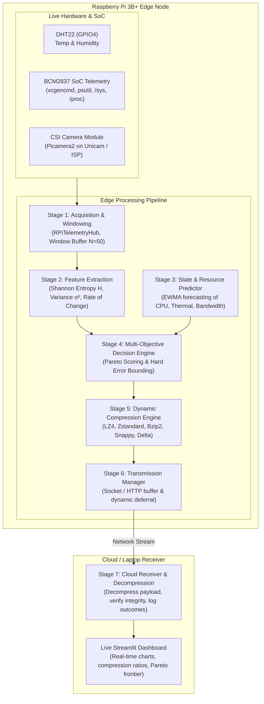

# Predictive Multi-Objective Compression Selection for IoT Edge Telemetry

An autonomous, multi-objective compression pipeline designed for resource-constrained edge devices (specifically the **Raspberry Pi 3B+** with Broadcom BCM2837 SoC). 

The system acquires live sensor and SoC telemetry, computes real-time information-theoretic and statistical features, predicts future resource states, and dynamically selects the Pareto-optimal compression algorithm under strict reconstruction error and energy constraints before transmitting data to the cloud.

---

## 1. System Architecture



---

## 2. Target Hardware Specifications (Raspberry Pi 3B+)

- **SoC**: Broadcom BCM2837 (64-bit Quad-Core ARM Cortex-A53 @ 1.4 GHz)
- **Architecture**: 32-bit `armv7l` (or 64-bit `aarch64`)
- **Memory**: 1 GB LPDDR2 SDRAM
- **Sensors Attached**:
  - **DHT22**: Single-wire digital ambient temperature & relative humidity sensor wired to **GPIO4 (Pin 7)** with a 10kΩ pull-up to 3.3V.
  - **CSI Camera Module**: 5MP OV5647 / 8MP IMX219 attached via the 15-pin CSI ribbon cable interface with zero-disk in-memory RAM streaming (`io.BytesIO`).
  - **SoC On-Die Telemetry (`vcgencmd` & `psutil`)**: Live querying of SoC core temperature, ARM CPU frequency, Core voltage, SDRAM controller/IO voltages, and the 20-bit under-voltage / thermal throttling bitmask register.

---

## 3. Pipeline Stages Breakdown

| Stage | Name | Key Functionality & Modules |
| :--- | :--- | :--- |
| **Stage 1** | **Data Acquisition & Windowing** | Polls live sensor and SoC telemetry through `RPiTelemetryHub` and batches samples into discrete `Window` objects (`N=50` samples or `T_max=5.0s` timeout). |
| **Stage 2** | **Feature Extraction** | Computes Shannon Entropy ($H$), statistical variance ($\sigma^2$), and Rate of Change ($\text{RoC}$) using pure Python built-in math (zero external C-library dependency). |
| **Stage 3** | **Resource & Network Predictor** | Forecasts next-window SoC thermal state, CPU load, and network conditions using Exponentially Weighted Moving Averages (EWMA). |
| **Stage 4** | **Multi-Objective Decision Engine** | Evaluates candidate compression algorithms under strict error limits ($\epsilon$) and scores them via multi-objective utility weighting: $\text{Score} = w_1 \cdot \text{Ratio} - w_2 \cdot \text{Energy} - w_3 \cdot \text{Latency} - w_4 \cdot \text{Error}$. |
| **Stage 5** | **Compression Execution** | Executes the winning algorithm (LZ4, Zstandard, Bzip2, Snappy, or Delta-encoding) on the window's serialized byte payload and records actual compression metrics. |
| **Stage 6** | **Transmission Manager** | Transmits the compressed payload or queues it locally when network bandwidth drops below a minimum threshold. |
| **Stage 7** | **Cloud Receiver & Dashboard** | Ingests incoming packets, decompresses payloads, logs outcome metrics to `logs/outcomes.csv`, and streams live telemetry to the dashboard. |

---

## 4. Hardware Wiring Diagram

```
Raspberry Pi 3B+ 40-Pin Header:
┌──────────────────────────────────────────────────┐
│  (3.3V)  [Pin 1] ───→ DHT22 VCC (Pin 1)          │
│  (GPIO2) [Pin 3]                                 │
│  (GPIO3) [Pin 5]                                 │
│  (GPIO4) [Pin 7] ───→ DHT22 DATA (Pin 2)         │
│                       [+ 10kΩ pull-up to 3.3V]   │
│  (GND)   [Pin 9] ───→ DHT22 GND (Pin 4)          │
└──────────────────────────────────────────────────┘

CSI Camera:
┌──────────────────────────────────────────────────┐
│  15-Pin CSI Ribbon Cable → Raspberry Pi CSI Port │
│  (Blue tape facing Ethernet/USB ports)           │
└──────────────────────────────────────────────────┘
```

---

## 5. Quickstart & Installation

### A. On the Raspberry Pi 3B+ (`armv7l`)

```bash
# 1. Clone the repository
git clone https://github.com/jain05vaibhav/Predictive-Multi-Objective-Compression-Selection.git
cd Predictive-Multi-Objective-Compression-Selection

# 2. Create and activate virtual environment
python3 -m venv .venv
source .venv/bin/activate

# 3. Install core lightweight edge requirements (pre-compiled wheels)
pip install -r requirements.txt

# 4. (Optional) Install physical camera and hardware libraries
sudo raspi-config # Enable Camera in Interface Options
sudo apt-get update
sudo apt-get install -y python3-picamera2 libgpiod2 libraspberrypi-bin
pip install adafruit-circuitpython-dht opencv-python
```

### B. On PC / Cloud (For Dashboard & Visualization)

```bash
# Install full dashboard dependencies including Streamlit and Pandas
pip install -r requirements-dashboard.txt
```

---

## 6. Execution & Verification Commands

### 1. Run Automated Unit Tests (29 Unit Tests)
```bash
python -m unittest discover tests -v
```

### 2. Test Live Hardware Sensors
```bash
# Test Native Raspberry Pi 3B+ SoC Metrics (vcgencmd & psutil)
python -m edge.sensors.rpi_system_reader

# Test CSI / USB Camera Capture (in-memory RAM buffer)
python -m edge.sensors.camera_reader

# Test DHT22 Sensor (GPIO4)
python -m edge.sensors.dht22_reader

# Test Unified Hardware Telemetry Hub
python -m edge.sensors.telemetry_source
```

### 3. Test Pipeline Stages Standalone
```bash
# Run Stage 1 Data Acquisition
python -m edge.stage1_acquisition

# Run Stage 2 Feature Extraction
python -m edge.stage2_features

# Run Stage 1 + Stage 2 End-to-End Inline Test
python -c "from edge.stage1_acquisition import AcquisitionStage; from edge.stage2_features import FeatureExtractionStage; s1 = AcquisitionStage(window_size=5); s2 = FeatureExtractionStage(); win = s1.acquire_window(); feats = s2.extract_features(win); print('Acquired Window:', win); print('Extracted Features:', feats)"
```

---

## 7. Repository Structure

```
Predictive-Multi-Objective-Compression-Selection/
├── edge/                          # Runs on Raspberry Pi 3B+ Edge Node
│   ├── config.py                  # Hyperparameters (N=50, T_max=5.0s, weights, binary paths)
│   ├── stage1_acquisition.py      # Window dataclass & AcquisitionStage engine
│   ├── stage2_features.py         # Pure-Python FeatureExtractionStage (Entropy, Var, RoC)
│   ├── stage3_predictor.py        # Resource & Network State Predictor (EWMA)
│   ├── stage4_decision.py         # Multi-Objective Decision Engine
│   ├── stage5_compression.py      # Compression Engine (LZ4, Zstd, Bzip2, Snappy)
│   ├── stage6_transmission.py     # Network Transmission & Deferral Manager
│   ├── main_loop.py               # Orchestrator running Stages 1–6 per window
│   └── sensors/
│       ├── rpi_system_reader.py   # Native RPi 3B+ SoC metrics (vcgencmd, psutil, /sys, /proc)
│       ├── telemetry_source.py    # Unified RPiTelemetryHub hardware coordinator
│       ├── camera_reader.py       # CSI/USB camera reader (Picamera2 / OpenCV / CLI)
│       └── dht22_reader.py        # Physical DHT22 GPIO sensor driver
├── cloud/                         # Cloud / Server Receiver
│   ├── receiver.py                # Stage 7 socket/HTTP ingestion server
│   └── outcome_store.py           # Persistent outcome logger
├── dashboard/                     # Web Dashboard
│   └── app.py                     # Streamlit live telemetry & Pareto visualization
├── docs/                          # Comprehensive Technical Documentation
│   ├── stage1_stage2_guide.md     # Stage 1 & 2 mathematical foundations and hardware guide
│   └── implmentation_plan_60.md   # Phase-by-phase implementation roadmap
├── tests/                         # Automated Unit Tests (29 Test Cases)
│   ├── test_rpi_system_reader.py  # Tests for vcgencmd parsing & psutil metrics
│   ├── test_stage1.py             # Tests for acquisition batching & windowing
│   ├── test_stage2.py             # Tests for Shannon entropy, variance, and RoC
│   ├── test_camera_reader.py      # Tests for RAM frame capture & stream buffers
│   └── test_stage3.py ... test_stage7.py
├── data/camera_captures/          # Single overwritten latest_frame.jpg snapshot
├── requirements.txt               # Lightweight edge node dependencies (armv7l compatible)
├── requirements-dashboard.txt     # Full cloud/dashboard dependencies
└── helpful_commands.txt           # CLI cheatsheet for quick testing
```
