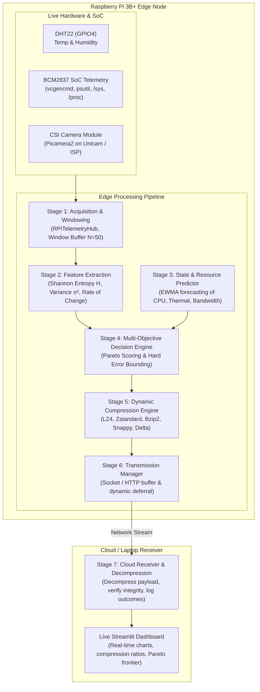

# Predictive Multi-Objective Compression Selection for IoT Edge Telemetry

An autonomous, multi-objective compression pipeline designed for resource-constrained edge devices (specifically the **Raspberry Pi 3B+** with Broadcom BCM2837 SoC). 

The system acquires live sensor and SoC telemetry, computes real-time information-theoretic and statistical features, predicts future resource states, and dynamically selects the Pareto-optimal compression algorithm under strict reconstruction error and energy constraints before transmitting data to the cloud.

---

## 1. System Architecture



---

## 2. Target Hardware Specifications (Raspberry Pi 3B+)

- **SoC**: Broadcom BCM2837 (64-bit Quad-Core ARM Cortex-A53 @ 1.4 GHz)
- **Architecture**: 32-bit `armv7l` (or 64-bit `aarch64`)
- **Memory**: 1 GB LPDDR2 SDRAM
- **Sensors Attached**:
  - **DHT22**: Single-wire digital ambient temperature & relative humidity sensor wired to **GPIO4 (Pin 7)** with a 10kΩ pull-up to 3.3V.
  - **CSI Camera Module**: 5MP OV5647 / 8MP IMX219 attached via the 15-pin CSI ribbon cable interface with zero-disk in-memory RAM streaming (`io.BytesIO`).
  - **SoC On-Die Telemetry (`vcgencmd` & `psutil`)**: Live querying of SoC core temperature, ARM CPU frequency, Core voltage, SDRAM controller/IO voltages, and the 20-bit under-voltage / thermal throttling bitmask register.

---

## 3. Pipeline Stages Breakdown

| Stage | Name | Status | Key Functionality & Modules |
| :--- | :--- | :---: | :--- |
| **Stage 1** | **Data Acquisition & Windowing** | ✅ Completed | Polls live sensor and SoC telemetry through `RPiTelemetryHub` and batches samples into discrete `Window` objects (`N=50` samples or `T_max=5.0s` timeout). |
| **Stage 2** | **Feature Extraction** | ✅ Completed | Computes Shannon Entropy ($H$), statistical variance ($\sigma^2$), and Rate of Change ($\text{RoC}$) using pure Python built-in math (zero external C-library dependency). |
| **Stage 3** | **Resource & State Predictor** | ✅ Completed | Forecasts next-window SoC thermal state, CPU load, and network conditions using Holt's Double Exponential Smoothing ($\alpha=0.3, \beta=0.2$) and hardware risk classifiers. |
| **Stage 4** | **Multi-Objective Decision Engine** | ✅ Completed | Solves error-bounded Pareto optimization: $\text{Score} = w_1 \cdot \text{Ratio} - w_2 \cdot \text{Energy} - w_3 \cdot \text{Latency} - w_4 \cdot \text{Error}$, adapting weights under thermal and bandwidth stress. |
| **Stage 5** | **Dynamic Compression Engine** | ✅ Completed | Executes candidate codecs (LZ4, Zstandard, Bzip2, Gzip, Delta-Zlib, Passthrough), profiling real latency, compression ratio, and CPU energy proxy with lossless verification. |
| **Stage 6** | **Network Transmission Manager** | ✅ Completed | Transmits payloads over TCP sockets or buffers into a local FIFO Deferral Queue during network dropouts, automatically draining backlog on link recovery. |
| **Stage 7** | **Cloud Receiver & Outcomes** | ✅ Completed | Ingests edge packets, decompresses payloads with inverse codecs, verifies 0% reconstruction error ($\epsilon=0.0$), commits to `logs/outcomes.csv`, and feeds dashboard. |

---

## 4. Hardware Wiring Diagram

```
Raspberry Pi 3B+ 40-Pin Header:
┌──────────────────────────────────────────────────┐
│  (3.3V)  [Pin 1] ───→ DHT22 VCC (Pin 1)          │
│  (GPIO2) [Pin 3]                                 │
│  (GPIO3) [Pin 5]                                 │
│  (GPIO4) [Pin 7] ───→ DHT22 DATA (Pin 2)         │
│                       [+ 10kΩ pull-up to 3.3V]   │
│  (GND)   [Pin 9] ───→ DHT22 GND (Pin 4)          │
└──────────────────────────────────────────────────┘

CSI Camera:
┌──────────────────────────────────────────────────┐
│  15-Pin CSI Ribbon Cable → Raspberry Pi CSI Port │
│  (Blue tape facing Ethernet/USB ports)           │
└──────────────────────────────────────────────────┘
```

---

## 5. Quickstart & Installation

### A. On the Raspberry Pi 3B+ (`armv7l`)

```bash
# 1. Clone the repository
git clone https://github.com/jain05vaibhav/Predictive-Multi-Objective-Compression-Selection.git
cd Predictive-Multi-Objective-Compression-Selection

# 2. Create and activate virtual environment
python3 -m venv .venv
source .venv/bin/activate

# 3. Install core lightweight edge requirements (pre-compiled wheels)
pip install -r requirements.txt

# 4. (Optional) Install physical camera and hardware libraries
sudo raspi-config # Enable Camera in Interface Options
sudo apt-get update
sudo apt-get install -y python3-picamera2 libgpiod2 libraspberrypi-bin
pip install adafruit-circuitpython-dht opencv-python
```

### B. On PC / Cloud (For Dashboard & Visualization)

```bash
# Install full dashboard dependencies including Streamlit and Pandas
pip install -r requirements-dashboard.txt
```

---

## 6. Execution & Verification Commands

### 1. Run Complete Automated Unit Test Suite (52 Unit Tests)
```bash
python -m unittest discover tests -v
```

### 2. Run the Autonomous End-to-End Edge Pipeline (All 7 Stages)
```bash
# Run continuous live edge pipeline loop (Press Ctrl+C to stop)
python -m edge.main_loop

# Run a specific number of test windows (e.g. 5 windows)
python -m edge.main_loop --windows 5 --window-size 5
```

### 3. Launch the Interactive Real-Time Streamlit Dashboard
```bash
streamlit run dashboard/app.py
```

### 4. Test Individual Stages Standalone
```bash
# Test Native Raspberry Pi 3B+ SoC Metrics (vcgencmd & psutil)
python -m edge.sensors.rpi_system_reader

# Test Combined Hardware Telemetry Ingestion Hub
python -m edge.sensors.telemetry_source

# Test Stage 1: Data Acquisition & Dynamic Windowing
python -m edge.stage1_acquisition

# Test Stage 2: Feature Extraction (Shannon Entropy H & Variance)
python -m edge.stage2_features

# Test Stage 3: Resource & State Predictor (Holt's Double Exponential Smoothing)
python -m edge.stage3_predictor

# Test Stage 4: Multi-Objective Decision Engine (Pareto Utility Scoring)
python -m edge.stage4_decision

# Test Stage 5: Dynamic Compression Execution Engine (All Codecs Benchmark)
python -m edge.stage5_compression

# Test Stage 6: Network Transmission & Deferral Queue Manager
python -m edge.stage6_transmission

# Test Stage 7: Cloud Receiver & Outcome Store Ingestion
python -m cloud.receiver
```

---

## 7. Repository Structure

```text
Predictive-Multi-Objective-Compression-Selection/
├── cloud/                      # Stage 7: Cloud Ingestion & Outcomes
│   ├── outcome_store.py        # Persistent outcome recorder & metrics aggregator
│   └── receiver.py             # Cloud decompression server & error verifier
├── dashboard/                  # Live visualization application
│   └── app.py                  # Streamlit real-time dashboard
├── data/camera_captures/       # RAM/disk camera buffer directory
├── docs/                       # Architectural guides and dataflow documentation
│   ├── pipeline_architecture_and_dataflow.md
│   ├── stage1_stage2_guide.md
│   └── implmentation_plan_60.md
├── edge/                       # Edge runtime modules (Raspberry Pi 3B+)
│   ├── config.py               # Hyperparameter constants & thresholds
│   ├── main_loop.py            # Autonomous 7-stage pipeline orchestrator
│   ├── stage1_acquisition.py   # Stage 1: Acquisition & dynamic windowing
│   ├── stage2_features.py      # Stage 2: Shannon entropy & feature extraction
│   ├── stage3_predictor.py     # Stage 3: Holt's linear trend & resource predictor
│   ├── stage4_decision.py      # Stage 4: Multi-objective Pareto decision engine
│   ├── stage5_compression.py   # Stage 5: Dynamic compression execution engine
│   ├── stage6_transmission.py  # Stage 6: Transmission & deferral queue manager
│   └── sensors/                # Hardware driver abstraction layer
│       ├── camera_reader.py    # CSI Camera (OV5647) reader with RAM buffer
│       ├── dht22_reader.py     # DHT22 temperature & humidity driver (GPIO4)
│       ├── rpi_system_reader.py# vcgencmd / psutil Broadcom SoC telemetry reader
│       └── telemetry_source.py # Unified hardware ingestion coordinator
├── logs/                       # Persistent telemetry and decision logs
│   ├── decisions.csv           # Stage 4 decision context logs
│   └── outcomes.csv            # Stage 7 verified ground-truth outcome logs
├── tests/                      # 52 Automated Unit Tests (Stages 1-7)
│   ├── test_camera_reader.py
│   ├── test_dht22_reader.py
│   ├── test_pipeline_integration.py
│   ├── test_rpi_system_reader.py
│   ├── test_stage1.py
│   ├── test_stage2.py
│   ├── test_stage3.py
│   ├── test_stage4.py
│   ├── test_stage5.py
│   ├── test_stage6.py
│   ├── test_stage7.py
│   └── test_telemetry_source.py
├── requirements.txt            # Lightweight edge requirements (Raspberry Pi)
├── requirements-dashboard.txt  # Dashboard requirements (Streamlit / Pandas)
└── README.md                   # Project overview & documentation
```

