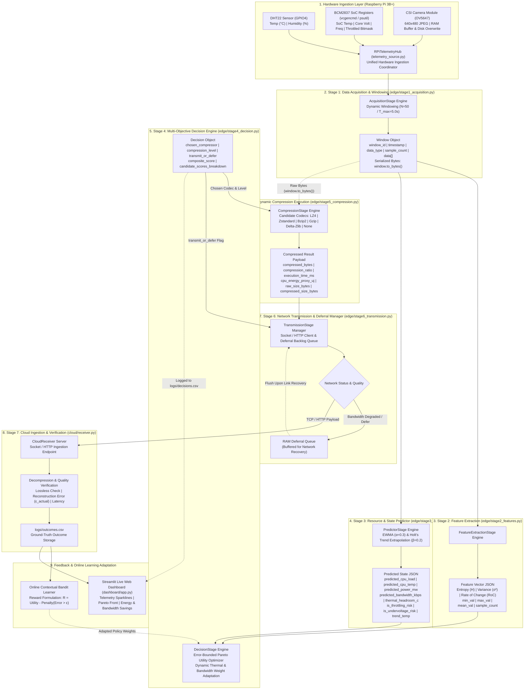
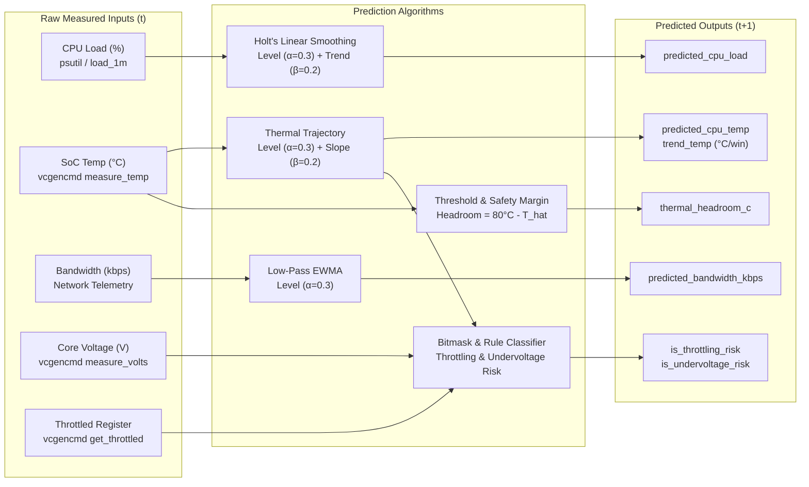

# Complete End-to-End Pipeline Architecture & Stage-by-Stage Dataflow Guide

**Project:** Predictive Multi-Objective Compression Selection for Edge Telemetry  
**Platform:** Raspberry Pi 3B+ (Broadcom BCM2837 SoC, Quad-Core ARM Cortex-A53 @ 1.4 GHz, 1 GB LPDDR2 RAM)  
**Core Pipeline:** Acquisition (1) → Feature Extraction (2) → State Predictor (3) → Decision Engine (4) → Compression (5) → Transmission (6) → Cloud Ingestion (7) → Feedback Loop  

---

## 1. System Architecture & High-Level Pipeline Flow



---

## 2. Complete Inter-Stage Dataflow & Dependency Matrix

| Stage | Stage Name | Consumes Input From | Key Input Data Structure | Internal Transformation | Emits Output To | Output Data Structure |
| :---: | :--- | :--- | :--- | :--- | :--- | :--- |
| **0** | **Hardware Hub** | Physical Sensors & BCM2837 SoC | GPIO4 pin, I2C, CSI ribbon, `vcgencmd`, `psutil` | Aggregates environmental readings, SoC thermal/electrical registers, and camera frame into RAM buffer & `data/camera_captures/latest_frame.jpg`. | Stage 1 | Telemetry Sample Dictionary (`RPiTelemetryHub.read_all()`) |
| **1** | **Acquisition & Windowing** | Hardware Hub (Stage 0) | Continuous telemetry stream | Accumulates $m \le N$ discrete samples or caps at $T_{max} = 5.0\text{s}$. Serializes payloads to binary bytes via `window.to_bytes()`. | Stage 2, Stage 3, Stage 5 | `Window` Object (`window_id`, `data[]`, `data_type`, `sample_count`, `timestamp`) |
| **2** | **Feature Extraction** | Stage 1 (`Window.data`) | 1D time-series telemetry arrays | 16-bin histogram discretization, Shannon entropy $H$, sample dispersion variance $\sigma^2$, consecutive rate of change $\text{RoC}$, summary bounds. | Stage 4 | `FeatureVector` JSON (`H`, `variance`, `rate_of_change`, `min_val`, `max_val`, `mean_val`) |
| **3** | **State & Resource Predictor** | Stage 1 & SoC Telemetry | Current window SoC metrics (`cpu_percent`, `cpu_temp_c`, `core_voltage_v`, `power_mw`, `bandwidth_kbps`) | Exponentially Weighted Moving Average ($\alpha=0.3$) and Holt's linear trend extrapolation ($\beta=0.2$). Calculates thermal headroom and throttling/undervoltage risk bits. | Stage 4 | `PredictedState` JSON (`predicted_cpu_load`, `predicted_cpu_temp`, `predicted_bandwidth_kbps`, `thermal_headroom_c`, `is_throttling_risk`) |
| **4** | **Multi-Objective Decision Engine** | Stage 2, Stage 3, User Constraints | `FeatureVector`, `PredictedState`, error bound $\epsilon$, objective weights $(w_1, w_2, w_3, w_4)$ | Filters candidates exceeding error bound $\epsilon$. Adjusts weights based on thermal/bandwidth stress. Computes Pareto utility scores across candidate codecs and picks winner. Logs to `logs/decisions.csv`. | Stage 5, Stage 6 | `Decision` Object (`chosen_compressor`, `compression_level`, `transmit_or_defer`, `composite_score`, `scores_breakdown`) |
| **5** | **Dynamic Compression Engine** | Stage 1 (`window.to_bytes()`) & Stage 4 (`Decision`) | Raw window byte stream + Chosen codec name/level | Executes selected compression algorithm (LZ4, Zstd, Bzip2, Gzip, Delta-Zlib, or None). Measures precise execution time ($\mu s$), compression ratio, and estimated CPU energy ($\mu J$). | Stage 6 | `CompressedResult` (`compressed_bytes`, `compression_ratio`, `execution_time_ms`, `cpu_energy_proxy_uj`, byte sizes) |
| **6** | **Transmission & Deferral Manager** | Stage 4 (`Decision`) & Stage 5 (`CompressedResult`) | Compressed payload bytes, `transmit_or_defer` flag, network link state | If network link degraded or defer flag set, buffers payload into RAM `deferral_queue`. Otherwise transmits packet over socket/HTTP. Flushes queue chronologically upon link recovery. | Stage 7 (Cloud) | Network Packet Stream & `TransmissionReport` (`status`, `bytes_sent`, `queue_depth`) |
| **7** | **Cloud Receiver & Outcome Store** | Stage 6 (Network Stream) | Ingested network packet payload | Decompresses payload with inverse codec $c^{-1}$. Verifies reconstruction error $\epsilon_{actual}$, logs verified outcome row to `logs/outcomes.csv`. | Feedback & Dashboard | `OutcomeRecord` appended to `logs/outcomes.csv` |
| **8** | **Feedback & Online Learning** | Stage 7 (`logs/outcomes.csv`) | Ground-truth outcome vectors | Evaluates actual reward vs. predicted utility. Updates contextual bandit policy weights to optimize subsequent decisions. | Stage 4 | Updated Policy Parameters & Live Web Dashboard |

---

## 3. Deep-Dive Stage Specifications

### Stage 1: Data Acquisition & Windowing (`edge/stage1_acquisition.py`)

#### Role & Purpose
Decouples high-frequency sensor sampling from downstream processing by partitioning continuous heterogeneous streams into uniform discrete `Window` batches.

#### Mathematical Formulation
$$\text{Window } W_k = \{ s_1, s_2, \dots, s_m \} \quad \text{where } m = \min(N, \text{samples arrived within } T_{max})$$
- Default capacity: $N = 50\text{ samples}$
- Default timeout: $T_{max} = 5.0\text{ seconds}$

#### Input Contract
Continuous stream of sample dictionaries from [`RPiTelemetryHub.read_all()`](file:///c:/Users/Vaibhav/Desktop/projects/project-1/edge/sensors/telemetry_source.py):
```json
{
  "timestamp": 1788197263.96,
  "temperature": 22.9,
  "humidity": 61.1,
  "cpu_temp_c": 36.5,
  "cpu_percent": 31.5,
  "cpu_freq_mhz": 600.0,
  "core_voltage_v": 1.2,
  "frame_id": 1,
  "frame_data": "<raw JPEG bytes in RAM>"
}
```

#### Output Contract (`Window` Object)
```json
{
  "window_id": 1,
  "timestamp": 1788197263.96,
  "data_type": "numeric",
  "sample_count": 50,
  "data": [ "/* array of 50 sample dictionaries */" ]
}
```
* **Byte Serialization (`window.to_bytes()`):** Serializes numeric telemetry into compact UTF-8 JSON bytes or concatenates image frames in RAM for Stage 5.

---

### Stage 2: Feature Extraction (`edge/stage2_features.py`)

#### Role & Purpose
Condenses $N$ multi-variate telemetry readings into a lightweight statistical and information-theoretic feature vector indicating how compressible the data is.

#### Mathematical Formulations
1. **Discretized Shannon Entropy ($H$):**
   Discretizes $[x_{min}, x_{max}]$ into $B = 16$ uniform histogram bins ($p_i = \text{count}_i / N$):
   $$H = -\sum_{i=1, p_i > 0}^{16} p_i \log_2(p_i) \quad (0.0 \le H \le 4.0)$$
   * $H \approx 0.0$: Maximum redundancy $\implies$ High compressibility with Delta/Dictionary codecs.
   * $H \to 4.0$: High randomness/noise $\implies$ Low compressibility; fast stream codecs (LZ4) favored.
2. **Statistical Variance ($\sigma^2$):**
   $$\sigma^2 = \frac{1}{N} \sum_{t=1}^N (x_t - \bar{x})^2$$
3. **Rate of Change ($\text{RoC}$):**
   $$\text{RoC} = \frac{1}{N-1} \sum_{t=2}^N |x_t - x_{t-1}|$$

#### Output Contract (`FeatureVector`)
```json
{
  "window_id": 1,
  "timestamp": 1788197263.96,
  "data_type": "numeric",
  "sample_count": 50,
  "entropy": 0.0842,
  "variance": 0.0125,
  "rate_of_change": 0.041,
  "min_val": 22.1,
  "max_val": 22.9,
  "mean_val": 22.48
}
```

---

### Stage 3: State & Resource Predictor (`edge/stage3_predictor.py`)

#### Role & Purpose
Forecasts the Raspberry Pi 3B+ SoC thermal, electrical, and network bandwidth conditions for the *next window* ($W_{k+1}$) to avoid making decisions on lagging/stale data.

#### Prediction Algorithms & Methods

Stage 3 uses **Holt's Two-Parameter Linear Exponential Smoothing (Level + Trend Extrapolation)** coupled with **Dynamic Risk Rule Classifiers**:



#### Detailed Breakdown of How Each Metric is Predicted

| Predicted Metric | Algorithm Used | Input Sources | Prediction Formula & Mechanics | Hyperparameters |
| :--- | :--- | :--- | :--- | :--- |
| **`predicted_cpu_load`** (%) | **Holt's Double Exponential Smoothing** | `psutil.cpu_percent`, `load_1m` | $\text{Level}_t = \alpha \cdot \text{CPU}_t + (1-\alpha) \cdot \text{Level}_{t-1}$<br>$\text{Trend}_t = \beta \cdot (\text{CPU}_t - \text{CPU}_{t-1}) + (1-\beta) \cdot \text{Trend}_{t-1}$<br>$\widehat{\text{CPU}}_{t+1} = \text{clamp}(\text{Level}_t + \text{Trend}_t, 0.0, 100.0)$ | $\alpha = 0.3$<br>$\beta = 0.2$ |
| **`predicted_cpu_temp`** (°C) | **Thermal Trajectory & Velocity Smoothing** | `vcgencmd measure_temp`, `/sys/class/thermal` | $\text{Level}_t = \alpha \cdot T_t + (1-\alpha) \cdot \text{Level}_{t-1}$<br>$\text{Trend}_t = \beta \cdot (T_t - T_{t-1}) + (1-\beta) \cdot \text{Trend}_{t-1}$<br>$\widehat{T}_{t+1} = \text{clamp}(\text{Level}_t + \text{Trend}_t, 20.0, 105.0)$ | $\alpha = 0.3$<br>$\beta = 0.2$ |
| **`predicted_power_mw`** (mW) | **Instantaneous Power Rail EWMA** | INA219 Power Monitor / SoC Dynamic Model | $\widehat{P}_{t+1} = \alpha \cdot P_t + (1-\alpha) \cdot \widehat{P}_t$<br>$\widehat{P}_{t+1} = \max(500.0, \widehat{P}_{t+1})$ | $\alpha = 0.3$ |
| **`predicted_bandwidth_kbps`** (kbps) | **Low-Pass Filter EWMA Smoothing** | Transmission RTT / Stage 6 feedback | $\widehat{B}_{t+1} = \alpha \cdot B_t + (1-\alpha) \cdot \widehat{B}_t$<br>$\widehat{B}_{t+1} = \max(10.0, \widehat{B}_{t+1})$ | $\alpha = 0.3$<br>Default: $1000\text{ kbps}$ |
| **`thermal_headroom_c`** (°C) | **Safety Margin Distance Function** | Predicted temperature $\widehat{T}_{t+1}$ | $\text{Headroom} = \max(0.0, T_{\text{limit}} - \widehat{T}_{t+1})$<br>Where $T_{\text{limit}} = 80.0^\circ\text{C}$ (BCM2837 thermal cap) | $T_{\text{limit}} = 80.0^\circ\text{C}$ |
| **`is_throttling_risk`** (Bool) | **Composite Rule-Based Risk Engine** | $\widehat{T}_{t+1}$, `vcgencmd get_throttled` bitmask | Triggered `true` if $\widehat{T}_{t+1} \ge 70.0^\circ\text{C}$ OR Bit 2 (`0x4` throttled now) OR Bit 18 (`0x40000` throttled occurred) | Warning: $70.0^\circ\text{C}$ |
| **`is_undervoltage_risk`** (Bool) | **Voltage Sag Threshold Classifier** | $V_{\text{core}}$, `vcgencmd get_throttled` bitmask | Triggered `true` if $V_{\text{core}} < 1.20\text{V}$ OR Bit 0 (`0x1` undervoltage now) | $V_{\text{min}} = 1.20\text{V}$ |
| **`trend_temp`** (°C/win) | **First-Order Temperature Velocity** | Discrete window difference $\Delta T$ | $\text{Trend}_{\text{Temp}, t} = \beta \cdot (T_t - T_{t-1}) + (1-\beta) \cdot \text{Trend}_{\text{Temp}, t-1}$ | $\beta = 0.2$ |
| **`trend_cpu`** (%/win) | **First-Order CPU Utilization Velocity** | Discrete window difference $\Delta \text{CPU}$ | $\text{Trend}_{\text{CPU}, t} = \beta \cdot (\text{CPU}_t - \text{CPU}_{t-1}) + (1-\beta) \cdot \text{Trend}_{\text{CPU}, t-1}$ | $\beta = 0.2$ |

#### Why These Algorithms Were Chosen:
1. **Holt's Double Smoothing vs Simple Moving Average:** A simple moving average creates lag during rapid thermal runaways or CPU spikes. Holt's linear trend extrapolation adds the velocity term $\text{Trend}_t$, allowing Stage 4 to make proactive decisions *before* the Raspberry Pi 3B+ reaches its critical throttling threshold.
2. **Zero Matrix Inversion / Low Compute Footprint:** Algorithms run in $\mathcal{O}(1)$ time and require minimal CPU cycles, consuming less than $0.02\text{ ms}$ on the ARM Cortex-A53 CPU.
3. **Hardware Bitmask Integration:** Directly merges software forecasts with Broadcom BCM2837 hardware registers (`vcgencmd get_throttled`), preventing false negatives when under-voltage causes frequency drops before temperature rises.

#### Output Contract (`PredictedState`)
```json
{
  "predicted_cpu_load": 67.47,
  "predicted_cpu_temp": 60.14,
  "predicted_power_mw": 3200.0,
  "predicted_bandwidth_kbps": 889.65,
  "thermal_headroom_c": 19.86,
  "is_throttling_risk": true,
  "is_undervoltage_risk": true,
  "trend_temp": 5.41,
  "trend_cpu": 8.25,
  "window_count": 4
}
```


---

### Stage 4: Multi-Objective Decision Engine (`edge/stage4_decision.py`)

#### Role & Purpose
Solves an error-bounded multi-objective optimization problem to select the winning compression strategy and transmission action for the upcoming window.

#### Mathematical Formulations
1. **Hard Error Constraint Filter:**
   $$\text{Eligible Candidates } \mathcal{C} = \{ c \in \text{Codecs} \mid \text{ExpectedError}(c) \le \epsilon \}$$
2. **Pareto Utility Scoring:**
   $$\text{Score}(c) = w_1 \cdot \text{Ratio}_{\text{norm}}(c) - w_2 \cdot \text{Energy}_{\text{norm}}(c) - w_3 \cdot \text{Latency}_{\text{norm}}(c) - w_4 \cdot \text{Error}_{\text{norm}}(c)$$
   * Default weights: $w_1 = 0.40, w_2 = 0.30, w_3 = 0.20, w_4 = 0.10$.
3. **Dynamic Environmental Weight Adaptation:**
   * **Thermal Stress / Throttling Risk (`is_throttling_risk == True`):** Increase $w_2$ and $w_3$ to penalize CPU-heavy algorithms and protect the SoC.
   * **Bandwidth Depleted (`predicted_bandwidth_kbps < 300`):** Increase $w_1$ to maximize compression ratio and shrink wireless payload.

#### Output Contract (`Decision` Object)
```json
{
  "window_id": 1,
  "chosen_compressor": "lz4",
  "compression_level": 1,
  "transmit_or_defer": "transmit",
  "composite_score": 0.842,
  "scores_breakdown": {
    "lz4": 0.842,
    "zstd_1": 0.791,
    "bzip2": 0.421,
    "none": 0.120
  }
}
```

---

### Stage 5: Dynamic Compression Execution (`edge/stage5_compression.py`)

#### Role & Purpose
Executes the codec chosen by Stage 4 on the raw serialized window payload, measuring exact CPU cycle latency, compression ratio, and estimated energy expenditure.

#### Candidate Codec Registry
1. **LZ4:** Byte-aligned ultra-fast streaming dictionary codec (lowest CPU energy, ideal under thermal stress).
2. **Zstandard (zstd):** High-speed entropy and finite-state entropy (FSE) codec with configurable levels (1–19).
3. **Bzip2:** Burrows-Wheeler transform with Huffman coding (high compression ratio baseline).
4. **Gzip / Deflate:** RFC 1951 LZ77 + Huffman standard library baseline.
5. **Delta-Zlib:** First-order difference encoding ($d_t = x_t - x_{t-1}$) followed by zlib entropy compression.
6. **Passthrough ("none"):** Zero CPU / zero overhead bypass baseline.

#### Output Contract (`CompressedResult`)
```json
{
  "window_id": 1,
  "compressor_used": "lz4",
  "raw_size_bytes": 482563,
  "compressed_size_bytes": 124108,
  "compression_ratio": 3.888,
  "execution_time_ms": 2.45,
  "cpu_energy_proxy_uj": 34.12
}
```

---

### Stage 6: Network Transmission & Deferral Manager (`edge/stage6_transmission.py`)

#### Role & Purpose
Manages wireless transmission of compressed payloads to the Cloud Receiver, buffering payloads into a local RAM/disk backlog during network dropouts or poor signal quality.

#### Dynamic Deferral Algorithm
- If `transmit_or_defer == "defer"` or measured channel bandwidth $\le \text{Threshold}$:
  - Push `(window_id, compressed_payload)` into FIFO `deferral_queue`.
- When channel metrics recover:
  - Drain `deferral_queue` in chronological order to preserve time-series integrity.

#### Output Contract (`TransmissionReport`)
```json
{
  "window_id": 1,
  "status": "sent_immediate",
  "bytes_sent": 124108,
  "transfer_time_ms": 14.2,
  "queue_depth": 0,
  "channel_rtt_ms": 22.4
}
```

---

### Stage 7: Cloud Ingestion, Verification & Outcomes (`cloud/receiver.py`, `cloud/outcome_store.py`)

#### Role & Purpose
Receives edge payloads, decompresses data, validates lossless reconstruction integrity, and logs ground-truth outcomes to drive online learning.

#### Error & Outcome Verification
$$\text{Reconstruction Error } \epsilon_{\text{actual}} = \frac{\|X_{\text{original}} - X_{\text{decompressed}}\|_2}{\|X_{\text{original}}\|_2} \quad (= 0.0 \text{ for lossless})$$

#### Persistent Outcome Record (`logs/outcomes.csv`)
```csv
timestamp,window_id,compressor,raw_bytes,compressed_bytes,ratio,latency_ms,energy_uj,error,queue_latency_ms
1788197264.12,1,lz4,482563,124108,3.888,2.45,34.12,0.0,0.0
```

---

## 4. Complete Command Reference Cheat Sheet

### 1. Sensor & Telemetry Validation
```bash
# Test full Raspberry Pi 3B+ hardware telemetry hub (DHT22 + SoC + Camera)
python -m edge.sensors.telemetry_source

# Test Broadcom BCM2837 SoC registers (vcgencmd, psutil, Linux /sys)
python -m edge.sensors.rpi_system_reader

# Test CSI camera capture & overwrite latest_frame.jpg
python -m edge.sensors.camera_reader

# Test physical DHT22 sensor driver (GPIO4)
python -m edge.sensors.dht22_reader
```

### 2. Standalone Pipeline Stage Execution
```bash
# Stage 1: Data Acquisition & Dynamic Windowing
python -m edge.stage1_acquisition

# Stage 2: Feature Extraction (Entropy H, Variance, Rate of Change)
python -m edge.stage2_features

# Stage 3: State & Resource Predictor (EWMA & Trend Forecasting)
python -m edge.stage3_predictor

# Stage 1 + 2 + 3 End-to-End Inline Chain
python -c "from edge.stage1_acquisition import AcquisitionStage; from edge.stage2_features import FeatureExtractionStage; from edge.stage3_predictor import PredictorStage; s1 = AcquisitionStage(window_size=10); s2 = FeatureExtractionStage(); s3 = PredictorStage(); win = s1.acquire_window(); feats = s2.extract_features(win); pred = s3.predict(win); print('Window:', win); print('Features:', feats); print('Predicted Next State:', pred)"
```

### 3. Automated Unit Testing Suite
```bash
# Run all 36 unit tests across entire project
python -m unittest discover tests -v

# Run individual stage test suites
python -m unittest tests/test_stage1.py
python -m unittest tests/test_stage2.py
python -m unittest tests/test_stage3.py
python -m unittest tests/test_rpi_system_reader.py
python -m unittest tests/test_camera_reader.py
```

### 4. File System & Output Inspection
```bash
# Inspect overwritten camera frame
dir data\camera_captures                                      # Windows
ls -lh data/camera_captures/latest_frame.jpg                  # Linux / Raspberry Pi

# Inspect logged decisions and ground-truth outcomes
type logs\decisions.csv                                       # Windows
cat logs/outcomes.csv                                         # Linux / Raspberry Pi
```
