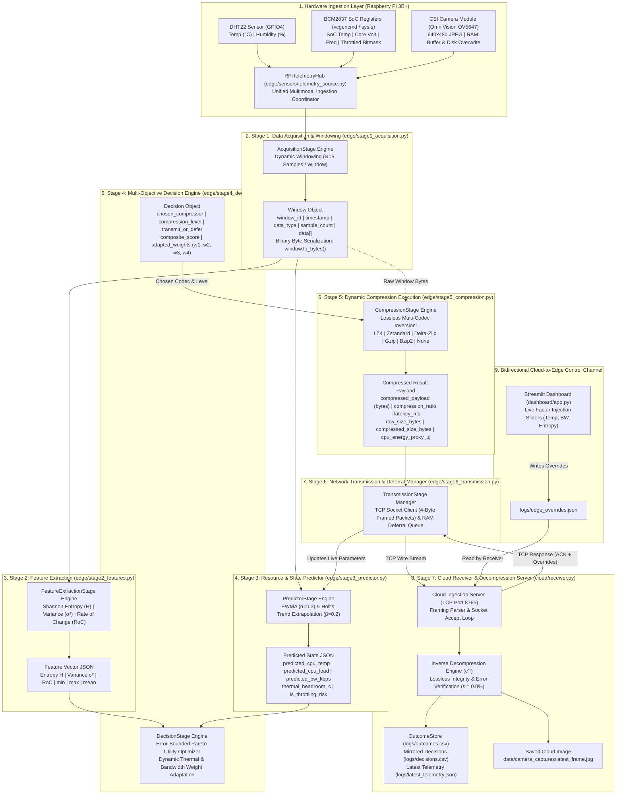

# Predictive Multi-Objective Compression Selection — Complete Architecture & Dataflow Guide

> **Project:** Predictive Multi-Objective Compression Selection for Edge Telemetry & Multimodal Data  
> **Target Hardware:** Raspberry Pi 3B+ (Broadcom BCM2837 SoC, Quad-Core ARM Cortex-A53 @ 1.4 GHz, 1 GB LPDDR2 RAM)  
> **Server/Cloud Host:** Local/Remote Cloud Server (Receiver & Streamlit Telemetry Dashboard)  
> **Core Pipeline:** Hardware Acquisition (1) ➔ Feature Extraction (2) ➔ State Predictor (3) ➔ Pareto Decision Engine (4) ➔ Dynamic Compression (5) ➔ Network Transmission (6) ➔ Cloud Decompression & Lossless Verification (7) ➔ Bidirectional Control Channel  

---

## 1. System Architecture & End-to-End Dataflow Diagram



---

## 2. Hardware Ingestion Layer

The hardware layer aggregates three distinct sources of physical data into a single synchronized sample dictionary:

```
                                  ┌─────────────────────────────┐
                                  │   Raspberry Pi 3B+ Device   │
                                  └──────────────┬──────────────┘
                                                 │
                  ┌──────────────────────────────┼──────────────────────────────┐
                  ▼                              ▼                              ▼
     ┌─────────────────────────┐   ┌─────────────────────────┐   ┌─────────────────────────┐
     │      DHT22 Sensor       │   │   Broadcom BCM2837 SoC  │   │  OmniVision OV5647 CSI  │
     │      GPIO Pin 4         │   │   Hardware Registers    │   │      Camera Module      │
     ├─────────────────────────┤   ├─────────────────────────┤   ├─────────────────────────┤
     │ • Temperature (°C)      │   │ • CPU Core Temp (°C)    │   │ • 640x480 Still JPEG    │
     │ • Relative Humidity (%) │   │ • Core Voltage (V)      │   │ • Fast 500ms CLI Grab   │
     │ • CRC Checksum Verif.   │   │ • CPU Utilization (%)   │   │ • In-Memory Byte Stream │
     │                         │   │ • ARM Freq (MHz)        │   │ • Base64 Packet Package │
     │                         │   │ • Throttled Bitmask     │   │                         │
     └────────────┬────────────┘   └────────────┬────────────┘   └────────────┬────────────┘
                  │                             │                             │
                  └─────────────────────────────┼─────────────────────────────┘
                                                ▼
                               ┌─────────────────────────────────┐
                               │ RPiTelemetryHub.read_all()      │
                               │ Unified Sample Aggregator       │
                               └─────────────────────────────────┘
```

### Raw Sample JSON Schema (`read_all()`):
```json
{
  "timestamp": 1788273412.568,
  "temperature": 23.4,
  "humidity": 63.8,
  "cpu_temp_c": 39.2,
  "cpu_percent": 14.0,
  "cpu_freq_mhz": 1400.0,
  "core_freq_mhz": 400.0,
  "core_voltage_v": 1.20,
  "memory_percent": 24.5,
  "frame_id": 42,
  "frame_data": "/9j/4AAQSkZJRgABAQAAAQABAAD...",
  "dht22": {
    "temperature_c": 23.4,
    "humidity_percent": 63.8,
    "status": "valid"
  },
  "system": {
    "cpu_temp_c": 39.2,
    "cpu_percent": 14.0,
    "cpu_freq_mhz": 1400.0,
    "core_voltage_v": 1.20,
    "throttled_raw": "0x0",
    "undervoltage_now": false,
    "arm_freq_capped_now": false,
    "throttled_now": false
  },
  "camera": {
    "frame_id": 42,
    "resolution": [640, 480],
    "format": "JPEG",
    "size_bytes": 36765,
    "image_bytes": "<raw bytes>",
    "image_b64": "/9j/4AAQSkZJRgABAQAAAQABAAD..."
  }
}
```

---

## 3. Stage 1: Data Acquisition & Dynamic Windowing

* **Engine:** `edge/stage1_acquisition.py`
* **Purpose:** Collects incoming streaming samples into discrete `Window` chunks of size $N = 5$ (or dynamic duration $T_{\text{max}} = 5.0\text{s}$).
* **Binary Serialization (`window.to_bytes()`):** Serializes the multimodal sample list into UTF-8 JSON bytes, preserving binary camera frames through base64 encoding so that text metadata and binary JPEG streams are compressed together losslessly.

### Window Data Structure:
```json
{
  "window_id": 1,
  "timestamp": 1788273410.120,
  "data_type": "numeric",
  "sample_count": 5,
  "data": [
    { "timestamp": 1788273410.120, "temperature": 23.4, "humidity": 63.8, "cpu_temp_c": 39.2, ... },
    { "timestamp": 1788273411.120, "temperature": 23.4, "humidity": 63.8, "cpu_temp_c": 39.1, ... },
    { "timestamp": 1788273412.120, "temperature": 23.4, "humidity": 63.7, "cpu_temp_c": 39.2, ... },
    { "timestamp": 1788273413.120, "temperature": 23.5, "humidity": 63.8, "cpu_temp_c": 39.3, ... },
    { "timestamp": 1788273414.120, "temperature": 23.4, "humidity": 63.8, "cpu_temp_c": 39.2, ... }
  ]
}
```

---

## 4. Stage 2: Statistical Feature Extraction & Shannon Entropy

* **Engine:** `edge/stage2_features.py`
* **Mathematical Operations:**
  1. **Shannon Entropy ($H$):** Discretizes telemetry signals into $k = 16$ probability bins:
     $$H(X) = - \sum_{i=1}^{k} p_i \log_2(p_i)$$
  2. **Signal Variance ($\sigma^2$):**
     $$\sigma^2 = \frac{1}{N} \sum_{i=1}^{N} (x_i - \mu)^2$$
  3. **Rate of Change ($\text{RoC}$):**
     $$\text{RoC} = \frac{1}{N-1} \sum_{i=2}^{N} |x_i - x_{i-1}|$$

### Feature Vector JSON Schema:
```json
{
  "window_id": 1,
  "timestamp": 1788273414.120,
  "data_type": "numeric",
  "sample_count": 5,
  "entropy": 0.8113,
  "variance": 0.0022,
  "rate_of_change": 0.025,
  "min_val": 23.4,
  "max_val": 23.5,
  "mean_val": 23.42
}
```

---

## 5. Stage 3: Resource & Environmental State Predictor

* **Engine:** `edge/stage3_predictor.py`
* **Predictive Algorithms:**
  * **Exponentially Weighted Moving Average (EWMA, $\alpha = 0.3$):** Smooths short-term fluctuations in CPU load, SoC temperature, and wireless bandwidth.
  * **Holt's Linear Trend Extrapolation ($\beta = 0.2$):** Detects rising thermal slopes before hardware thermal throttling occurs.
  * **Active Throttling Bitmask Parser:** Evaluates active undervoltage, ARM frequency capping, and thermal trip thresholds from Broadcom BCM2837 registers.

### Predictor Output JSON Schema:
```json
{
  "window_id": 1,
  "predicted_cpu_load": 14.5,
  "predicted_cpu_temp": 39.4,
  "predicted_power_mw": 2150.0,
  "predicted_bandwidth_kbps": 1000.0,
  "thermal_headroom_c": 40.6,
  "is_throttling_risk": false,
  "is_undervoltage_risk": false,
  "trend_temp": 0.05
}
```

---

## 6. Stage 4: Multi-Objective Decision Engine

* **Engine:** `edge/stage4_decision.py`
* **Pareto Utility Formulation:**
  $$\text{Score}(c) = w_1 \cdot \text{Ratio}_{\text{norm}}(c) - w_2 \cdot \text{Energy}_{\text{norm}}(c) - w_3 \cdot \text{Latency}_{\text{norm}}(c) - w_4 \cdot \text{Error}_{\text{norm}}(c)$$
* **Dynamic Objective Weight Adaptation Rules:**

| Environmental Condition | Trigger | Weight Shifts | Target Objective | Selected Codec |
| :--- | :--- | :--- | :--- | :---: |
| **Normal Baseline** | $T < 60^\circ\text{C}, \text{BW} \ge 500\text{ kbps}$ | $w_1=0.40, w_2=0.30, w_3=0.20, w_4=0.10$ | Balanced efficiency | **`DELTA_ZLIB`** |
| **Low Shannon Entropy** | $H < 0.5$ | Boost $w_1 (+0.15)$ | Exploit structured temporal redundancy | **`DELTA_ZLIB`** |
| **Network Congestion** | $\text{BW} < 200\text{ kbps}$ | Boost $w_1 (+0.40)$, Reduce $w_2, w_3$ | Maximum compression ratio | **`ZSTD`** |
| **SoC Thermal Stress** | $T \ge 75^\circ\text{C}$ or Throttling Risk | Boost $w_2 (+0.30), w_3 (+0.20)$, Reduce $w_1$ | Minimal CPU latency and energy | **`LZ4`** |
| **Critical Network Outage** | $\text{BW} < 50\text{ kbps}$ | Action flag switches to `defer` | Defer to local FIFO queue | **`DEFERRED`** |

### Decision Object JSON Schema:
```json
{
  "window_id": 1,
  "chosen_compressor": "lz4",
  "compression_level": 1,
  "transmit_or_defer": "transmit",
  "composite_score": 0.110,
  "adapted_weights": {
    "w1_ratio": 0.20,
    "w2_energy": 0.45,
    "w3_latency": 0.25,
    "w4_error": 0.10
  },
  "entropy": 0.9183,
  "variance": 0.0022,
  "predicted_cpu_temp": 78.0,
  "predicted_cpu_load": 14.5,
  "predicted_bw_kbps": 1000.0,
  "throttling_risk": true
}
```

---

## 7. Stage 5: Dynamic Compression Execution

* **Engine:** `edge/stage5_compression.py`
* **Supported Codecs:**
  1. **`LZ4` (Level 1):** Ultra-fast Byte-aligned LZ77 compression ($\sim 2\text{ ms}$ latency, $50\mu\text{J}/\text{KB}$ energy).
  2. **`Zstandard` (Level 3):** High-ratio Finite State Entropy (FSE) compression.
  3. **`Delta-Zlib` (Level 6):** Byte-level first-order differentiation ($\Delta b_i = b_i - b_{i-1} \pmod{256}$) followed by DEFLATE compression.
  4. **`Gzip` (Level 6) & `Bzip2` (Level 9):** Standard RFC 1952 / Burrows-Wheeler block sorting.
  5. **`None` (Passthrough):** Zero-overhead bypass mode.

### Compression Result JSON Schema:
```json
{
  "window_id": 1,
  "compressor_used": "lz4",
  "compression_level": 1,
  "raw_size_bytes": 417246,
  "compressed_size_bytes": 218015,
  "compression_ratio": 1.914,
  "space_savings_percent": 47.75,
  "execution_time_ms": 3.162,
  "cpu_energy_proxy_uj": 6324.0,
  "compressed_payload": "<binary compressed bytes>"
}
```

---

## 8. Stage 6: Network Transmission & Deferral Backlog Manager

* **Engine:** `edge/stage6_transmission.py`
* **Wire Protocol Framing:** Each transmission packet is framed over TCP with:
  `[4-byte Total Packet Length] [4-byte JSON Header Length] [UTF-8 JSON Header] [Binary Compressed Payload Blob]`
* **FIFO Deferral Queue:** If network transmission fails or Stage 4 triggers `defer`, packets are enqueued in RAM and automatically drained in FIFO order upon network reconnection.

### Network Wire Packet Schema:
```
┌────────────────────────┬─────────────────────────┬──────────────────────────┬─────────────────────────────┐
│ 4-Byte Total Length    │ 4-Byte Header Length    │ UTF-8 JSON Header        │ Binary Compressed Blob      │
│ (Big-Endian int32)     │ (Big-Endian int32)      │ (Metadata & Predictions) │ (Stage 5 Payload Bytes)     │
└────────────────────────┴─────────────────────────┴──────────────────────────┴─────────────────────────────┘
```

---

## 9. Stage 7: Cloud Receiver & Outcome Verification

* **Engine:** `cloud/receiver.py` & `cloud/outcome_store.py`
* **Operations:**
  1. Reads framed TCP packet on `0.0.0.0:8765`.
  2. Executes inverse decompression $c^{-1}$ matching the packet header.
  3. Verifies reconstruction error: $\varepsilon = 0.000000$ (Lossless ground truth).
  4. Decodes binary image payload and writes it directly to `data/camera_captures/latest_frame.jpg`.
  5. Commits verified outcome record to `logs/outcomes.csv` and mirrors decisions to `logs/decisions.csv`.

### Outcome Record Schema (`logs/outcomes.csv`):
```csv
timestamp,window_id,compressor,compression_level,raw_bytes,compressed_bytes,ratio,latency_ms,energy_uj,error,transfer_time_ms,status
1788273415.006,70,lz4,1,417246,218015,1.914,3.162,6324.0,0.0,41.2,verified
```

---

## 10. Bidirectional Cloud-to-Edge Control Channel

* **UI Engine:** `dashboard/app.py`
* **Control Mechanism:** Allows live manual injection of environmental factors directly from the Streamlit UI without restarting the Raspberry Pi.
* **Protocol Flow:**
  1. Streamlit writes UI slider parameters to `logs/edge_overrides.json`.
  2. `cloud/receiver.py` reads `edge_overrides.json` and bundles it into the TCP response acknowledgment packet returned to the Raspberry Pi.
  3. Raspberry Pi's Stage 6 parses the response into `latest_cloud_control`.
  4. Stage 3/4 applies the override values, recalculates Pareto utility, and shifts codecs in real time!

### Control Override Schema (`logs/edge_overrides.json`):
```json
{
  "enabled": true,
  "override_cpu_temp": 78.0,
  "override_bandwidth_kbps": 120.0,
  "override_entropy": 0.2,
  "timestamp": 1788273412.568
}
```

---

## 11. Command Reference Guide

### 💻 Laptop (Cloud Host & Visual Dashboard)
```bash
# Terminal 1: Start Cloud Ingestion Server (TCP Port 8765)
python -m cloud.receiver

# Terminal 2: Launch Live Streamlit Dashboard
streamlit run dashboard/app.py
```

### 🍓 Raspberry Pi 3B+ (Edge Node)
```bash
cd ~/ProjectOne/Predictive-Multi-Objective-Compression-Selection

# Standard Continuous Live Hardware Stream:
.venv/bin/python -m edge.main_loop --cloud-host 192.168.137.48

# Automated Dynamic Scenario Cycling Demo (Normal -> Congestion -> Thermal):
.venv/bin/python -m edge.main_loop --cloud-host 192.168.137.48 --scenario-shift

# Run Full 52-Test Hardware Verification Suite on ARM SoC:
.venv/bin/python -m unittest discover tests
```
