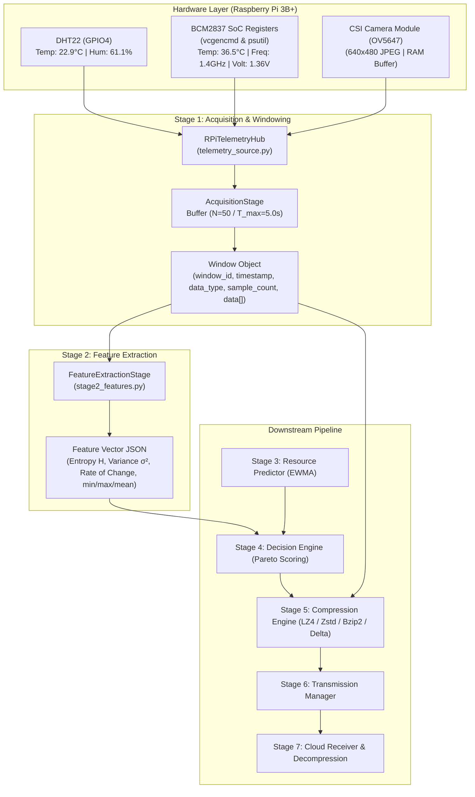

# Stage 1, Stage 2 & Stage 3 Guide: Acquisition, Features & State Prediction

**Project:** Predictive Multi-Objective Compression Selection for Edge Telemetry  
**Target Hardware Platform:** Raspberry Pi 3B+ (Broadcom BCM2837 SoC, Quad-Core Cortex-A53 @ 1.4 GHz, 1 GB LPDDR2 RAM)  
**Pipeline Stages Covered:** 
- **Stage 1:** Data Acquisition & Dynamic Windowing (`edge/stage1_acquisition.py`)
- **Stage 2:** Feature Extraction (`edge/stage2_features.py`)
- **Stage 3:** State & Resource Predictor (`edge/stage3_predictor.py`)


---

## 1. Overview & Pipeline Flow

The edge pipeline continuously samples real physical environment sensors and on-die Broadcom BCM2837 SoC performance registers, buffers them into discrete `Window` objects, extracts statistical and information-theoretic indicators, and routes the extracted feature vector to the multi-objective compression selector.



---

## 2. Mathematical Formulations

### Stage 1: Window Accumulation
A window $W_k$ aggregates $m$ continuous samples where $m \le N$:
- **Window Capacity ($N$):** Maximum sample count (default: $N = 50$).
- **Maximum Collection Duration ($T_{max}$):** Timeout threshold (default: $T_{max} = 5.0\text{ s}$).

$$\text{Window } W_k = \{ s_1, s_2, \dots, s_m \} \quad \text{where } m = \min(N, \text{samples within } T_{max})$$

---

### Stage 2: Feature Extraction Formulations

#### 1. Discretized Shannon Entropy ($H$)
Given a 1D telemetry series $X = \{x_1, x_2, \dots, x_m\}$, discretize the dynamic span $[x_{min}, x_{max}]$ into $B = 16$ uniform histogram bins:
- Width of each bin: $\Delta x = \frac{x_{max} - x_{min}}{B}$
- Probability of bin $i$: $p_i = \frac{\text{count}(\text{bucket}_i)}{m}$
- **Shannon Entropy ($H$):**
  $$H = -\sum_{i=1, p_i > 0}^B p_i \log_2(p_i)$$
- **Physical Interpretation:**
  - $H = 0.0$: Perfectly uniform or constant signal $\implies$ Maximum redundancy, ideal for delta/dictionary codecs.
  - $H \to \log_2(16) = 4.0$: High randomness/entropy $\implies$ Incompressible noise; fast low-overhead stream codecs (LZ4) prioritized.

#### 2. Statistical Variance ($\sigma^2$)
Measures the signal dispersion around its arithmetic mean $\bar{x} = \frac{1}{m}\sum x_t$:
$$\sigma^2 = \frac{1}{m} \sum_{t=1}^m (x_t - \bar{x})^2$$

#### 3. Rate of Change ($\text{RoC}$)
Measures the mean step-to-step absolute transition magnitude:
$$\text{RoC} = \frac{1}{m-1} \sum_{t=2}^m |x_t - x_{t-1}|$$

---

### Stage 3: State & Resource Predictor Formulations

Instead of reacting to stale measurements, Stage 3 projects system resource states for the next window $W_{k+1}$ to allow proactive Pareto codec optimization and prevent thermal throttling on the Raspberry Pi 3B+ SoC.

#### 1. Exponentially Weighted Moving Average (EWMA)
For any metric $x$ (CPU utilization $L$, SoC temperature $T$, power consumption $P$, or bandwidth $B$), EWMA level $\hat{x}_{t}$ with smoothing factor $\alpha = 0.3$:
$$\hat{x}_{t} = \alpha \cdot x_t + (1 - \alpha) \cdot \hat{x}_{t-1}$$

#### 2. Holt's Linear Trend Extrapolation
Captures rapid rate of temperature rise (°C/window) and CPU escalation (%/window) with trend factor $\beta = 0.2$:
$$\text{Trend}_t = \beta \cdot (x_t - x_{t-1}) + (1 - \beta) \cdot \text{Trend}_{t-1}$$
$$\text{Forecast}_{t+1} = \hat{x}_t + \text{Trend}_t$$

#### 3. Thermal Headroom & Risk Indicators
- **Thermal Headroom:** Degrees Celsius remaining before hard thermal limit $T_{limit} = 80.0^\circ\text{C}$:
  $$\text{Headroom} = \max\left(0, T_{limit} - \hat{T}_{t+1}\right)$$
- **Throttling Risk:** Triggered (`true`) if $\hat{T}_{t+1} \ge 70.0^\circ\text{C}$ or active hardware throttle bits are detected in `throttled_hex`.
- **Undervoltage Risk:** Triggered (`true`) if core voltage drops $< 1.20\text{V}$ or under-voltage register bit is active.


---

## 3. Complete JSON Schemas & Data Formats

### Format 1: Unified Telemetry Sample (`RPiTelemetryHub.read_all()`)
Every continuous sample acquired by Stage 1 contains top-level shortcuts and structured sub-sections:

```json
{
  "timestamp": 1788197263.96,
  "temperature": 22.9,
  "humidity": 61.1,
  "cpu_temp_c": 36.5,
  "cpu_percent": 31.5,
  "cpu_freq_mhz": 600.0,
  "core_freq_mhz": 250.0,
  "core_voltage_v": 1.2,
  "memory_percent": 26.4,
  "frame_id": 1,
  "frame_data": "<base64/bytes in RAM>",
  "dht22": {
    "temperature_c": 22.9,
    "humidity_percent": 61.1
  },
  "system": {
    "cpu_temp_c": 36.5,
    "cpu_freq_mhz": 600.0,
    "core_freq_mhz": 250.0,
    "core_voltage_v": 1.2,
    "sdram_c_voltage_v": 1.25,
    "sdram_i_voltage_v": 1.25,
    "sdram_p_voltage_v": 1.225,
    "throttled_hex": "0x50005",
    "undervoltage_now": true,
    "arm_freq_capped_now": false,
    "throttled_now": false,
    "soft_temp_limit_now": false,
    "undervoltage_occurred": true,
    "arm_freq_capped_occurred": false,
    "throttling_occurred": true,
    "soft_temp_limit_occurred": false,
    "cpu_percent": 31.5,
    "cpu_count": 4,
    "load_1m": 0.18,
    "load_5m": 0.22,
    "load_15m": 0.15,
    "memory_total_mb": 920.03,
    "memory_used_mb": 242.61,
    "memory_free_mb": 677.42,
    "memory_percent": 26.4,
    "vcgencmd_available": true
  },
  "camera": {
    "frame_id": 1,
    "resolution": [640, 480],
    "format": "JPEG",
    "size_bytes": 71436,
    "saved_path": "/home/cache/ProjectOne/Predictive-Multi-Objective-Compression-Selection/data/camera_captures/latest_frame.jpg"
  }
}
```

---

### Format 2: Stage 1 `Window` Object (`Window.to_dict()`)
Represents an accumulated window of $N$ samples emitted to Stage 2:

```json
{
  "window_id": 1,
  "timestamp": 1788197263.96,
  "data_type": "numeric",
  "sample_count": 50,
  "data": [
    {
      "timestamp": 1788197263.96,
      "temperature": 22.9,
      "humidity": 61.1,
      "cpu_temp_c": 36.5,
      "cpu_percent": 31.5,
      "core_voltage_v": 1.2,
      "cpu_freq_mhz": 600.0
    },
    {
      "timestamp": 1788197264.06,
      "temperature": 22.9,
      "humidity": 61.2,
      "cpu_temp_c": 36.6,
      "cpu_percent": 28.2,
      "core_voltage_v": 1.2,
      "cpu_freq_mhz": 600.0
    }
  ]
}
```

#### Serialized Byte Format (`Window.to_bytes()`)
- For **numeric/telemetry** data: UTF-8 encoded JSON payload ready for compression codecs.
- For **image/vision** data: Direct concatenation of binary JPEG frames (`b"".join(item['image_bytes'])`).

---

### Format 3: Stage 2 Feature Vector (`FeatureExtractionStage.extract_features()`)
The condensed output consumed by the Stage 4 Decision Engine:

```json
{
  "window_id": 1,
  "timestamp": 1788197263.96,
  "data_type": "numeric",
  "sample_count": 50,
  "entropy": 0.0842,
  "variance": 0.0125,
  "rate_of_change": 0.041,
  "min_val": 22.1,
  "max_val": 22.9,
  "mean_val": 22.48
}
```

---

### Format 4: Stage 3 Resource Prediction Vector (`PredictorStage.predict()`)
The forecasted next-window system resource state fed into Stage 4:

```json
{
  "predicted_cpu_load": 67.47,
  "predicted_cpu_temp": 60.14,
  "predicted_power_mw": 3200.0,
  "predicted_bandwidth_kbps": 889.65,
  "thermal_headroom_c": 19.86,
  "is_throttling_risk": true,
  "is_undervoltage_risk": true,
  "trend_temp": 5.41,
  "trend_cpu": 8.25,
  "window_count": 4
}
```

---

### Format 5: Stage 4 Decision Engine Schema (Downstream Contract)


#### Decision Engine Input Schema:
```json
{
  "feature_vector": {
    "entropy": 0.0842,
    "variance": 0.0125,
    "rate_of_change": 0.041,
    "sample_count": 50
  },
  "predicted_state": {
    "cpu_load": 0.315,
    "cpu_temp": 36.5,
    "bandwidth_mbps": 12.4
  },
  "task_criticality": "routine",
  "epsilon_error_bound": 0.05
}
```

#### Decision Engine Output Schema:
```json
{
  "window_id": 1,
  "chosen_compressor": "lz4",
  "compression_level": 1,
  "transmit_or_defer": "transmit",
  "composite_score": 0.842,
  "scores_breakdown": {
    "lz4": 0.842,
    "zstd_1": 0.791,
    "bzip2": 0.421,
    "none": 0.12
  }
}
```

---

### Format 5: Stage 5 Compression Result Schema
Output emitted after executing the chosen codec:

```json
{
  "window_id": 1,
  "compressor_used": "lz4",
  "raw_size_bytes": 482563,
  "compressed_size_bytes": 124108,
  "compression_ratio": 3.888,
  "execution_time_ms": 2.45,
  "cpu_energy_proxy_uj": 34.12
}
```

---

## 4. Complete Field Dictionary & Specification

| Field Name | Type | Unit / Format | Source Module | Description |
| :--- | :---: | :---: | :---: | :--- |
| `timestamp` | `float` | Seconds (epoch) | System | POSIX timestamp of sample or window creation. |
| `temperature` / `temperature_c` | `float` | °C | DHT22 (GPIO4) | Ambient room temperature measured by DHT22. |
| `humidity` / `humidity_percent` | `float` | % | DHT22 (GPIO4) | Ambient relative humidity percentage (0–100%). |
| `cpu_temp_c` | `float` | °C | BCM2837 SoC | On-die core thermal diode reading via `vcgencmd measure_temp`. |
| `cpu_freq_mhz` | `float` | MHz | BCM2837 SoC | Current ARM Cortex-A53 clock speed (600 MHz idle – 1400 MHz max). |
| `core_freq_mhz` | `float` | MHz | VideoCore IV | GPU Core clock speed (250 MHz idle – 400 MHz turbo). |
| `core_voltage_v` | `float` | V | BCM2837 SoC | Dynamic voltage scaling supply (1.20 V – 1.36 V). |
| `sdram_c_voltage_v` | `float` | V | SDRAM | Memory controller rail voltage (1.25 V). |
| `sdram_i_voltage_v` | `float` | V | SDRAM | Memory I/O rail voltage (1.25 V). |
| `sdram_p_voltage_v` | `float` | V | SDRAM | Memory PHY rail voltage (1.225 V). |
| `throttled_hex` | `str` | Hexadecimal | BCM2837 SoC | Raw 20-bit register string (e.g. `"0x50005"`). |
| `undervoltage_now` | `bool` | Boolean | Bit 0 (`0x1`) | `true` if power supply rail dipped below 4.63V. |
| `arm_freq_capped_now` | `bool` | Boolean | Bit 1 (`0x2`) | `true` if ARM clock frequency is currently capped. |
| `throttled_now` | `bool` | Boolean | Bit 2 (`0x4`) | `true` if thermal or power throttling is currently active. |
| `soft_temp_limit_now` | `bool` | Boolean | Bit 3 (`0x8`) | `true` if soft temperature limit (60°C) is active. |
| `undervoltage_occurred` | `bool` | Boolean | Bit 16 (`0x10000`) | `true` if under-voltage occurred at any point since boot. |
| `throttling_occurred` | `bool` | Boolean | Bit 18 (`0x40000`) | `true` if throttling occurred at any point since boot. |
| `cpu_percent` | `float` | % | `psutil` | Instantaneous total CPU utilization percentage. |
| `cpu_count` | `int` | Count | `psutil` | Number of logical CPU cores (4 on Raspberry Pi 3B+). |
| `load_1m` | `float` | Load factor | `os.getloadavg` | 1-minute system load average. |
| `memory_total_mb` | `float` | MB | `psutil` | Total usable physical RAM (e.g. 920.03 MB). |
| `memory_used_mb` | `float` | MB | `psutil` | Currently allocated RAM (e.g. 242.61 MB). |
| `memory_percent` | `float` | % | `psutil` | Physical RAM utilization percentage (e.g. 26.4%). |
| `frame_id` | `int` | Sequential ID | CameraReader | Incrementing counter of captured camera frames. |
| `resolution` | `tuple` | `[width, height]` | CameraReader | Camera resolution, default `(640, 480)`. |
| `format` | `str` | MIME/Type | CameraReader | Image container format, default `"JPEG"`. |
| `size_bytes` | `int` | Bytes | CameraReader | Byte size of raw JPEG frame in RAM. |
| `saved_path` | `str` | File path | CameraReader | Path to overwritten file on disk (`data/camera_captures/latest_frame.jpg`). |
| `entropy` | `float` | Shannon bits | Stage 2 | Discretized information entropy ($0.0 \le H \le 4.0$). |
| `variance` | `float` | $\sigma^2$ | Stage 2 | Sample dispersion across the window. |
| `rate_of_change` | `float` | Value/step | Stage 2 | Average consecutive difference magnitude. |

---

## 5. Hardware Pinout & Wiring Configuration

```
Raspberry Pi 3B+ GPIO Header (J8) Pinout:
┌──────────────────────────────────────────────────────────┐
│  [Pin 1] 3.3V Power  ───────────→ DHT22 VCC (Pin 1)     │
│  [Pin 2] 5.0V Power                                      │
│  [Pin 7] GPIO4 (BCM 4) ─────────→ DHT22 DATA (Pin 2)    │
│          └─── 10kΩ Pull-up Resistor to 3.3V (Pin 1)      │
│  [Pin 9] Ground (GND) ──────────→ DHT22 GND (Pin 4)     │
└──────────────────────────────────────────────────────────┘

CSI Camera Connector (Between HDMI and Audio Out):
┌──────────────────────────────────────────────────────────┐
│  15-pin Ribbon Cable → Raspberry Pi CSI Camera Port      │
│  - Contacts face toward HDMI port                        │
│  - Blue backing tape faces toward Ethernet / USB ports   │
└──────────────────────────────────────────────────────────┘
```

---

## 6. Live Raspberry Pi 3B+ Verified Outputs

Real output captured directly from the Raspberry Pi 3B+ (`cache@ghost`):

### 1. Unified Telemetry Hub (`python -m edge.sensors.telemetry_source`)
```text
=== Testing Raspberry Pi 3B+ Hardware Telemetry Hub ===
[CameraReader] Native libcamera CLI detected: still=rpicam-still, video=rpicam-vid

[DHT22 Environmental Sensor]
  Temperature: 22.9 °C
  Humidity:    61.1 %

[Raspberry Pi 3B+ System Telemetry]
  SoC Temp:         36.5 °C
  CPU Freq (ARM):   600.0 MHz
  Core Freq:        250.0 MHz
  Core Voltage:     1.2 V
  Throttling State: 0x50005 (Undervoltage now: True)
  CPU Utilization:  31.5 % (Load 1m: 0.18)
  Memory Usage:     242.61 MB / 920.03 MB (26.4 %)

[Camera Reader]
  Frame ID:       1
  Resolution:     (640, 480)
  Format:         JPEG
  RAM Size:       71436 bytes

=== Telemetry Hub test complete ===
```

### 2. Standalone Stage 1 Acquisition (`python -m edge.stage1_acquisition`)
```text
=== Stage 1: Data Acquisition Standalone Test (Raspberry Pi 3B+) ===
[CameraReader] Native libcamera CLI detected: still=rpicam-still, video=rpicam-vid
Acquiring 2 windows with window_size=5...

Emitted <Window id=1 type='numeric' samples=1 ts=1788197263.96>
  [Sample Preview]
    - DHT22 Temp / Hum:    22.1 °C, 62.7 %
    - RPi SoC Temp / Freq: 35.9 °C, 600.0 MHz
    - RPi Core Voltage:    1.2 V
    - RPi CPU / Mem Load:  50.8 %, 28.4 %
    - Camera:              Frame #1 (Size: 67219 bytes)
  Serialized Window Byte Size: 473494 bytes

Stage 1 execution complete.
```

### 3. Standalone Stage 2 Feature Extraction (`python -m edge.stage2_features`)
```text
=== Stage 2: Feature Extraction Standalone Test ===
Constant window: H=0.0000, var=0.0000, roc=0.0000
Linear ramp window: H=3.9925, var=208.2500, roc=1.0000
Uniform noise window (1000 samples, 16 bins): H=3.9863 (theoretical max ~ 4.0000)
Stage 2 execution complete.
```

### 4. Standalone Stage 3 State & Resource Predictor (`python -m edge.stage3_predictor`)
```text
=== Testing Stage 3: State & Resource Predictor ===

[Step 1] Input: CPU=15.0% | Temp=42.0 deg C | BW=1200.0 kbps
  -> Forecasted CPU Load:   15.0%
  -> Forecasted SoC Temp:   42.0 deg C (Trend: +0.00 deg C/win)
  -> Forecasted Bandwidth:  1200.0 kbps
  -> Thermal Headroom:      38.0 deg C
  -> Throttling Risk:       False
  -> Undervoltage Risk:     False

[Step 4] Input: CPU=95.0% | Temp=72.5 deg C | BW=400.0 kbps
  -> Forecasted CPU Load:   67.47%
  -> Forecasted SoC Temp:   60.14 deg C (Trend: +5.41 deg C/win)
  -> Forecasted Bandwidth:  889.65 kbps
  -> Thermal Headroom:      19.86 deg C
  -> Throttling Risk:       True
  -> Undervoltage Risk:     True
```

---

## 7. Command Reference

### Environment Setup (Raspberry Pi 3B+)
```bash
# 1. Virtual environment
python3 -m venv .venv
source .venv/bin/activate

# 2. Precompiled lightweight dependencies
pip install -r requirements.txt

# 3. Hardware sensor libraries
sudo raspi-config  # Enable Camera interface
sudo apt-get update
sudo apt-get install -y python3-picamera2 libgpiod2 libraspberrypi-bin
pip install adafruit-circuitpython-dht opencv-python psutil
```

### Verification & Testing
```bash
# Run all 36 automated unit tests
python -m unittest discover tests -v

# Run individual sensor and stage tests
python -m edge.sensors.rpi_system_reader
python -m edge.sensors.camera_reader
python -m edge.sensors.dht22_reader
python -m edge.sensors.telemetry_source
python -m edge.stage1_acquisition
python -m edge.stage2_features
python -m edge.stage3_predictor
```

