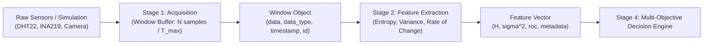

# Stage 1 & Stage 2 Documentation: Data Acquisition & Feature Extraction

**Project:** Predictive Multi-Objective Compression Selection  
**Pipeline Stages Covered:** 
- **Stage 1:** Data Acquisition & Windowing
- **Stage 2:** Feature Extraction (Shannon Entropy, Variance, Rate of Change)

---

## 1. Overview & Purpose

In IoT edge telemetry systems, continuous high-frequency sensor readings must be processed efficiently. Stages 1 and 2 form the input and analysis foundation of the entire pipeline:
1. **Stage 1 (Acquisition & Windowing):** Converts a continuous, heterogeneous sensor stream into discrete, uniform time/sample windows.
2. **Stage 2 (Feature Extraction):** Condenses each window into key statistical and information-theoretic indicators (Shannon Entropy, Variance, Rate of Change) required by the Stage 4 Decision Engine to select the optimal compression algorithm.



---

## 2. Mathematical Foundations & Algorithms

### Stage 1: Windowing Algorithm
Given a continuous stream of sensor readings, a window $W_k$ is accumulated according to:
- **Window Size ($N$):** Maximum number of samples per window (configured via `WINDOW_SIZE_N = 50`).
- **Timeout ($T_{max}$):** Maximum wait duration (seconds) before emitting a partial window if sensor transmission is slow.

$$\text{Window } W_k = \{ s_1, s_2, \dots, s_m \} \quad \text{where } m = \min(N, \text{samples within } T_{max})$$

### Stage 2: Feature Extraction

#### 1. Histogram Discretization & Shannon Entropy ($H$)
Discretizes numeric series into $B$ equal-width histogram bins over the observed dynamic range $[x_{min}, x_{max}]$:
- Probability of bin $i$:
  $$p_i = \frac{\text{count}(\text{bucket}_i)}{N}$$
- **Shannon Entropy ($H$):**
  $$H = -\sum_{i=1, p_i > 0}^B p_i \log_2(p_i)$$
- **Physical Interpretation:**
  - $H \approx 0.0$: Signal is constant or highly redundant $\implies$ Highly compressible via delta/dictionary algorithms.
  - $H \to \log_2(B)$ (e.g. $4.0$ for $16$ bins): High randomness / noise $\implies$ Harder to compress losslessly.

#### 2. Statistical Variance ($\sigma^2$)
Measures the dispersion / thermal fluctuation across the window:
$$\sigma^2 = \frac{1}{N} \sum_{t=1}^N (x_t - \bar{x})^2$$

#### 3. Rate of Change ($\text{RoC}$)
Measures the average step-to-step absolute transition magnitude:
$$\text{RoC} = \frac{1}{N-1} \sum_{t=2}^N |x_t - x_{t-1}|$$

---

## 3. Codebase Architecture

```
edge/
├── config.py                 # Hyperparameters (N=50, T_max=5.0s, weights)
├── stage1_acquisition.py     # Window class & AcquisitionStage engine
├── stage2_features.py        # FeatureExtractionStage (Entropy, Var, RoC)
└── sensors/
    ├── simulated_source.py   # Hybrid simulated generator & hardware coordinator
    ├── camera_reader.py      # CSI/USB camera reader (Picamera2 / OpenCV / CLI)
    ├── dht22_reader.py       # DHT22 GPIO sensor reader
    └── ina219_power.py       # INA219 I2C power sensor reader
tests/
├── test_stage1.py            # Unit tests for Stage 1 (partitioning, timeouts)
└── test_stage2.py            # Unit tests for Stage 2 (entropy bounds, variance)
```

---

## 4. Hardware vs. Simulation Modes


The pipeline contains an automatic **hybrid fallback architecture**:

| Mode | Configuration | Behavior |
|---|---|---|
| **Simulation Mode** (Default) | `USE_REAL_HARDWARE = False` in `simulated_source.py` | Generates realistic, fluctuating DHT22 temperature/humidity, INA219 power, and synthetic camera frames. Runs on any laptop or OS without hardware. |
| **Physical Hardware Mode** | `USE_REAL_HARDWARE = True` in `simulated_source.py` | Reads real physical sensors (DHT22 on GPIO4, INA219 on I2C, CSI Camera via Picamera2/OpenCV/CLI) on Raspberry Pi. |
| **Hybrid Fallback Mode** | `USE_REAL_HARDWARE = True` (with partial hardware) | If a camera or subset of sensors is connected, it **reads real hardware data while safely simulating missing sensors without crashing**. |

---

## 5. Sensor Telemetry Schema & Storage Architecture

### Telemetry Payload Structure (`SimulatedSource.read_all()`)

Each sample gathered during acquisition contains structured sub-sections for every sensor:

```python
{
    "timestamp": 1788171660.84,
    # Direct top-level access keys
    "temperature": 23.98,          # Ambient temperature in °C
    "humidity": 60.12,             # Relative humidity percentage
    "voltage_v": 5.07,             # Raspberry Pi bus voltage in V
    "current_ma": 441.85,          # Raspberry Pi current draw in mA
    "power_mw": 2240.18,           # Raspberry Pi total power in mW
    "frame_id": 1,                 # Camera sequential frame number
    "frame_data": b"...",          # Raw frame bytes in memory
    
    # Detailed sub-dictionaries per sensor module
    "dht22": {
        "temperature_c": 23.98,
        "humidity_percent": 60.12
    },
    "ina219": {
        "voltage_v": 5.07,
        "bus_voltage_v": 5.07,
        "current_ma": 441.85,
        "power_mw": 2240.18,
        "shunt_voltage_mv": 44.19
    },
    "camera": {
        "frame_id": 1,
        "resolution": (640, 480),
        "format": "JPEG",
        "image_bytes": b"...",     # Live binary payload in RAM
        "size_bytes": 5438
    }
}
```

### In-Memory vs. On-Disk Data Flow

1. **In-Memory Storage (Default Streaming Pipeline):**
   * **`CameraReader` / `SimulatedSource`**: When `save_photo_in_memory()`, `capture_frame()`, or `read_camera()` runs, raw JPEG bytes are stored in RAM as a Python `bytes` object and a dedicated `io.BytesIO` stream.
   * **Direct In-Memory Access**: Downstream components can call `camera.get_in_memory_buffer()` to obtain the in-memory stream directly for image transforms or compression without touching disk.
   * **Stage 1 `Window` Buffer**: Samples are buffered in RAM as a list in `window.data`. The method `window.to_bytes()` serializes the entire window into an in-memory byte stream ready for Stage 5 compression.
   * **Zero Disk Overhead**: In standard continuous operation, no image or sensor files are written to disk, preventing SD card wear and latency on the Raspberry Pi.

2. **Folder Storage & Overwrite (`data/camera_captures/`):**
   * **Destination Folder:** All camera captures are automatically saved to `data/camera_captures/` (created automatically if missing).
   * **Overwrite Mode:** On every run or capture, the file **`latest_frame.jpg`** is overwritten with the newest frame:
     ```
     data/camera_captures/latest_frame.jpg
     ```
   * **Metadata Reference:** The returned camera dictionary includes `"saved_path"` with the absolute path of the overwritten file.

---

## 6. Complete Execution & Testing Command Reference


### A. Environment Setup & Dependencies

#### 1. Create Virtual Environment:
```bash
python -m venv .venv
```

#### 2. Activate Virtual Environment:
* **Windows PowerShell:**
  ```powershell
  .\.venv\Scripts\Activate.ps1
  ```
* **Windows Command Prompt (CMD):**
  ```cmd
  .\.venv\Scripts\activate.bat
  ```
* **Linux / Raspberry Pi (Bash):**
  ```bash
  source .venv/bin/activate
  ```

#### 3. Install Python Dependencies:
```bash
pip install -r requirements.txt
```

#### 4. (Raspberry Pi Physical Hardware Only) Enable Interfaces & Install Drivers:
```bash
# Enable I2C and Camera interfaces via GUI/CLI menu:
sudo raspi-config

# Install system libraries for camera and GPIO:
sudo apt-get update
sudo apt-get install -y python3-picamera2 libgpiod2 i2c-tools
pip install adafruit-circuitpython-dht adafruit-circuitpython-ina219 opencv-python
```

---

### B. Sensor Module Execution & Smoke Testing

#### 1. Test All Sensors in Simulation/Hybrid Mode:
Tests aggregated readings from DHT22, INA219, and CSI camera (overwrites `data/camera_captures/latest_frame.jpg`):
```bash
python -m edge.sensors.simulated_source
```

#### 2. Test Camera Reader Directly:
Captures a live frame into RAM and overwrites `data/camera_captures/latest_frame.jpg`:
```bash
python -m edge.sensors.camera_reader
```

#### 3. Test Physical DHT22 Sensor (GPIO4):
```bash
python -m edge.sensors.dht22_reader
```

#### 4. Test Physical INA219 Power Monitor (I2C):
```bash
python -m edge.sensors.ina219_power
```

---

### C. Pipeline Stage Execution

#### 1. Run Stage 1 Data Acquisition Standalone:
Acquires continuous windows of size $N=10$ and previews temperature, humidity, power rail, and camera frame payload:
```bash
python -m edge.stage1_acquisition
```

#### 2. Run Stage 2 Feature Extraction Standalone:
Validates feature extraction (Shannon Entropy, Variance, Rate of Change) across constant, ramp, and uniform noise series:
```bash
python -m edge.stage2_features
```

#### 3. Run Pipeline End-to-End One-Liner:
Acquires a live/simulated window and immediately extracts features in a single command:
```bash
python -c "from edge.stage1_acquisition import AcquisitionStage; from edge.stage2_features import FeatureExtractionStage; s1 = AcquisitionStage(window_size=10); s2 = FeatureExtractionStage(); win = s1.acquire_window(); feats = s2.extract_features(win); print('Acquired:', win); print('Features:', feats)"
```

---

### D. Automated Unit Test Suite

#### 1. Run Entire Test Suite (19 Test Cases):
```bash
python -m unittest discover tests
```

#### 2. Run Entire Test Suite with Verbose Output:
```bash
python -m unittest discover tests -v
```

#### 3. Run Specific Test Modules:
* **Stage 1 (Acquisition & Partitioning):**
  ```bash
  python -m unittest tests/test_stage1.py
  ```
* **Stage 2 (Mathematical Bounds & Feature Extraction):**
  ```bash
  python -m unittest tests/test_stage2.py
  ```
* **Camera Reader & In-Memory / Folder Storage:**
  ```bash
  python -m unittest tests/test_camera_reader.py
  ```

---

### E. File System & Output Inspection

#### 1. Inspect Overwritten Camera Frame File:
* **Windows PowerShell:**
  ```powershell
  Get-Item data\camera_captures\latest_frame.jpg
  ```
* **Windows CMD:**
  ```cmd
  dir data\camera_captures
  ```
* **Linux / Raspberry Pi:**
  ```bash
  ls -lh data/camera_captures/latest_frame.jpg
  ```

#### 2. Inspect Telemetry & Decision Logs:
* **Windows:**
  ```cmd
  type logs\decisions.csv
  type logs\outcomes.csv
  ```
* **Linux / Raspberry Pi:**
  ```bash
  cat logs/decisions.csv
  cat logs/outcomes.csv
  ```

---

## 7. Sample Outputs

### 1. Simulated Source (`python -m edge.sensors.simulated_source`)
```text
=== Testing SimulatedSource Telemetry Generation ===

[DHT22 Reading]
  Temperature: 23.98 °C
  Humidity:    60.12 %

[INA219 Power Monitor]
  Voltage:     5.07 V
  Current:     441.85 mA
  Power:       2240.18 mW

[CSI Camera Module (In-Memory & Folder Overwrite)]
  Frame ID:       1
  Resolution:     (640, 480)
  Format:         JPEG
  RAM Size:       44 bytes
  RAM Address:    0x23f9b2d07b0
  BytesIO Object: <_io.BytesIO object at ...> (size: 44 bytes)
  Saved Folder:   data/camera_captures/
  Overwritten At: C:\Users\Vaibhav\Desktop\projects\project-1\data\camera_captures\latest_frame.jpg
  Raw Preview:    b'FRAME_1_PAYLOAD_TIMESTAMP_1788171660.841'...

=== SimulatedSource test complete ===
```

### 2. Camera Reader (`python -m edge.sensors.camera_reader`)
```text
=== Testing Camera Capture & Storage (Folder Overwrite Mode) ===
[CameraReader] OpenCV VideoCapture initialized successfully.
Capturing photo and overwriting destination folder...

[Photo Capture Details]
  Frame ID:       #1
  Resolution:     (640, 480)
  Format:         JPEG
  RAM Size:       55794 bytes in RAM
  BytesIO Stream: <_io.BytesIO object at ...> (size: 55794 bytes)
  Saved Folder:   data/camera_captures/
  Overwritten At: C:\Users\Vaibhav\Desktop\projects\project-1\data\camera_captures\latest_frame.jpg
=== Capture Complete ===
```

### 3. Stage 1 Window Acquisition (`python -m edge.stage1_acquisition`)
```text
=== Stage 1: Data Acquisition Standalone Test ===
Acquiring 3 windows with window_size=10...
Emitted <Window id=1 type='numeric' samples=10 ts=1788171622.17>
  First sample preview:
    - Temperature: 23.79 °C
    - Humidity:    59.65 %
    - Power Rail:  5.087 V, 446.94 mA, 2273.58 mW
    - Camera:      Frame #1 | Format: JPEG | Resolution: (640, 480) | Payload Size: 43 bytes
  Serialized Window Byte Size: 5602 bytes
```

### 4. Stage 2 Feature Extraction (`python -m edge.stage2_features`)
```text
=== Stage 2: Feature Extraction Standalone Test ===
Constant window: H=0.0000, var=0.0000, roc=0.0000
Linear ramp window: H=4.0000, var=208.2500, roc=1.0000
Uniform noise window (1000 samples, 16 bins): H=3.9926 (theoretical max ~ 4.0000)
Stage 2 execution complete.
```


