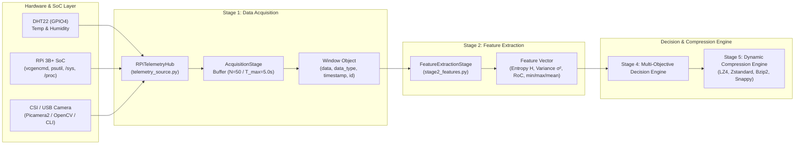

# Stage 1 & Stage 2 Documentation: Data Acquisition & Feature Extraction

**Project:** Predictive Multi-Objective Compression Selection  
**Target Platform:** Raspberry Pi 3B+ (Broadcom BCM2837 SoC)  
**Pipeline Stages Covered:** 
- **Stage 1:** Data Acquisition & Windowing
- **Stage 2:** Feature Extraction (Shannon Entropy, Variance, Rate of Change)

---

## 1. Overview & Architecture

In IoT edge telemetry and vision pipelines, continuous high-frequency physical sensor readings and onboard SoC metrics must be acquired, batched, and analyzed efficiently without stalling the operating system.

Stages 1 and 2 establish the real-time data foundation of the pipeline:
1. **Stage 1 (Acquisition & Windowing):** Polls real-time hardware telemetry (DHT22 environmental sensor, Raspberry Pi 3B+ SoC metrics, and CSI camera frames) into discrete, uniformly sized `Window` objects.
2. **Stage 2 (Feature Extraction):** Condenses each multi-dimensional sample window into essential statistical and information-theoretic indicators (Shannon Entropy $H$, Variance $\sigma^2$, Rate of Change $\text{RoC}$) that guide the **Stage 4 Multi-Objective Decision Engine** in selecting the optimal compression algorithm.



---

## 2. Mathematical Foundations & Algorithms

### Stage 1: Dynamic Windowing Algorithm
Given a continuous stream of telemetry samples, an acquisition window $W_k$ is accumulated according to:
- **Window Size ($N$):** Target sample count per window (configured as `WINDOW_SIZE_N = 50`).
- **Timeout ($T_{max}$):** Maximum collection window time before emitting a partial window if sensor transmission is slow (`DEFAULT_SAMPLE_TIMEOUT = 5.0` seconds).

$$\text{Window } W_k = \{ s_1, s_2, \dots, s_m \} \quad \text{where } m = \min(N, \text{samples within } T_{max})$$

### Stage 2: Feature Extraction

#### 1. Histogram Discretization & Shannon Entropy ($H$)
Discretizes numeric series into $B$ equal-width histogram bins ($B = 16$) across the observed dynamic range $[x_{min}, x_{max}]$:
- Bin probability $p_i$:
  $$p_i = \frac{\text{count}(\text{bucket}_i)}{N}$$
- **Shannon Entropy ($H$):**
  $$H = -\sum_{i=1, p_i > 0}^B p_i \log_2(p_i)$$
- **Physical Interpretation:**
  - $H \approx 0.0$: Signal is constant or highly redundant $\implies$ Maximum compression ratio achievable via dictionary or delta encoders.
  - $H \to \log_2(B) = 4.0$: High randomness / thermal noise $\implies$ Harder to compress losslessly; fast stream compressors (e.g., LZ4) preferred over slow high-ratio codecs.

#### 2. Statistical Variance ($\sigma^2$)
Measures sample dispersion and signal spread across the window:
$$\sigma^2 = \frac{1}{N} \sum_{t=1}^N (x_t - \bar{x})^2$$

#### 3. Rate of Change ($\text{RoC}$)
Measures average step-to-step absolute transition magnitude:
$$\text{RoC} = \frac{1}{N-1} \sum_{t=2}^N |x_t - x_{t-1}|$$

---

## 3. Codebase Structure

```
edge/
├── config.py                 # Configuration parameters (N=50, T_max=5.0s, weights, RPi binary paths)
├── stage1_acquisition.py     # Window class & AcquisitionStage engine
├── stage2_features.py        # FeatureExtractionStage (Entropy, Variance, RoC)
└── sensors/
    ├── rpi_system_reader.py  # Native RPi 3B+ SoC metrics reader (vcgencmd, psutil, /sys, /proc)
    ├── telemetry_source.py   # Unified RPiTelemetryHub hardware coordinator
    ├── camera_reader.py      # CSI/USB camera reader (Picamera2 / OpenCV / libcamera CLI)
    └── dht22_reader.py       # Physical DHT22 GPIO sensor driver
tests/
├── test_rpi_system_reader.py # Unit tests for vcgencmd parsing & psutil metrics
├── test_stage1.py            # Unit tests for Stage 1 (batch partitioning, timeouts)
├── test_stage2.py            # Unit tests for Stage 2 (entropy bounds, variance, RoC)
└── test_camera_reader.py     # Unit tests for camera frames & in-memory RAM buffers
```

---

## 4. Raspberry Pi 3B+ Native Telemetry Metrics

The system telemetry reader ([edge/sensors/rpi_system_reader.py](file:///c:/Users/Vaibhav/Desktop/projects/project-1/edge/sensors/rpi_system_reader.py)) interfaces directly with the Broadcom BCM2837 SoC:

| Metric Group | Specific Metric | RPi 3B+ Retrieval Mechanism | Unit / Values |
| :--- | :--- | :--- | :--- |
| **SoC / CPU Temperature** | `cpu_temp_c` | `vcgencmd measure_temp` or `/sys/class/thermal/thermal_zone0/temp` | °C |
| **CPU Frequency (ARM)** | `cpu_freq_mhz` | `vcgencmd measure_clock arm` or `/sys/devices/system/cpu/cpu0/cpufreq/scaling_cur_freq` | MHz |
| **Core Frequency** | `core_freq_mhz` | `vcgencmd measure_clock core` | MHz |
| **Core Voltage** | `core_voltage_v` | `vcgencmd measure_volts core` | V |
| **SDRAM Voltages** | `sdram_c_voltage_v`<br>`sdram_i_voltage_v`<br>`sdram_p_voltage_v` | `vcgencmd measure_volts sdram_c`<br>`vcgencmd measure_volts sdram_i`<br>`vcgencmd measure_volts sdram_p` | V |
| **Throttling & Undervoltage** | `throttled_hex`<br>`undervoltage_now`<br>`throttled_now`<br>`undervoltage_occurred` | `vcgencmd get_throttled` (decoded bitmask) | Hex / bool |
| **CPU Utilization** | `cpu_percent` | `psutil.cpu_percent(interval=None)` or `/proc/stat` | % |
| **CPU Load Average** | `load_1m`, `load_5m`, `load_15m` | `os.getloadavg()` or `psutil.getloadavg()` | float |
| **Memory Usage** | `memory_total_mb`<br>`memory_used_mb`<br>`memory_percent` | `psutil.virtual_memory()` | MB / % |

### Throttling Bitmask Breakdown (`vcgencmd get_throttled`)

| Bit | Hex Value | Meaning |
| :---: | :---: | :--- |
| **0** | `0x1` | **Under-voltage detected now** |
| **1** | `0x2` | **ARM frequency capped now** |
| **2** | `0x4` | **Currently throttled** |
| **3** | `0x8` | **Soft temperature limit active now** |
| **16** | `0x10000` | **Under-voltage has occurred since boot** |
| **17** | `0x20000` | **ARM frequency capping has occurred since boot** |
| **18** | `0x40000` | **Throttling has occurred since boot** |
| **19** | `0x80000` | **Soft temperature limit has occurred since boot** |

---

## 5. Physical Sensor Wiring Reference (Raspberry Pi 3B+)

### 1. DHT22 Environmental Sensor (Temperature & Humidity)
- **VCC (Pin 1):** 3.3V Power (Raspberry Pi Pin 1)
- **DATA (Pin 2):** GPIO4 (Raspberry Pi Pin 7) with 10kΩ pull-up resistor to 3.3V
- **NC (Pin 3):** Not connected
- **GND (Pin 4):** Ground (Raspberry Pi Pin 9)

### 2. CSI Camera Module
- Connect the 15-pin ribbon cable to the **CSI Camera Port** located between the HDMI and Audio jack (blue tape facing Ethernet/USB connectors).

---

## 6. Telemetry Payload & In-Memory Storage Flow

### Complete Telemetry Sample Schema (`RPiTelemetryHub.read_all()`)

```python
{
    "timestamp": 1788171660.84,
    
    # Primary top-level access keys:
    "temperature": 23.98,          # DHT22 Ambient Temperature in °C
    "humidity": 60.12,             # DHT22 Relative Humidity percentage
    "cpu_temp_c": 48.2,            # RPi 3B+ SoC Temperature in °C
    "cpu_freq_mhz": 1200.0,        # ARM CPU Clock in MHz
    "core_freq_mhz": 400.0,        # VideoCore Clock in MHz
    "core_voltage_v": 1.25,        # Core Voltage in V
    "cpu_percent": 14.5,           # CPU Utilization %
    "memory_percent": 32.4,        # RAM Utilization %
    "frame_id": 1,                 # Camera sequential frame counter
    "frame_data": b"...",          # Raw JPEG image payload bytes in RAM
    
    # Structured module sub-dictionaries:
    "dht22": {
        "temperature_c": 23.98,
        "humidity_percent": 60.12
    },
    "system": {
        "cpu_temp_c": 48.2,
        "cpu_freq_mhz": 1200.0,
        "core_freq_mhz": 400.0,
        "core_voltage_v": 1.25,
        "sdram_c_voltage_v": 1.20,
        "sdram_i_voltage_v": 1.20,
        "sdram_p_voltage_v": 1.225,
        "throttled_hex": "0x0",
        "undervoltage_now": False,
        "throttled_now": False,
        "cpu_percent": 14.5,
        "cpu_count": 4,
        "load_1m": 0.35,
        "memory_total_mb": 948.2,
        "memory_used_mb": 307.2,
        "memory_percent": 32.4
    },
    "camera": {
        "frame_id": 1,
        "resolution": (640, 480),
        "format": "JPEG",
        "image_bytes": b"...",
        "size_bytes": 5438,
        "saved_path": "data/camera_captures/latest_frame.jpg"
    }
}
```

### In-Memory vs. Disk Data Flow

1. **In-Memory Streaming (Default Zero-Disk Mode):**
   * Raw camera bytes and sensor dictionaries are held in RAM.
   * Direct in-memory access via `camera_reader.get_in_memory_buffer()` or `window.to_bytes()`.
   * **Zero Disk Wear:** Prevents SD card wear and eliminates I/O latency bottlenecks on the Raspberry Pi.

2. **Folder Storage & Single Overwrite (`data/camera_captures/`):**
   * Saves the single latest snapshot to `data/camera_captures/latest_frame.jpg` without accumulating historical disk files.

---

## 7. Command Reference & Validation

### A. Environment Setup

#### 1. Setup Virtual Environment:
```bash
# Linux / Raspberry Pi:
python -m venv .venv
source .venv/bin/activate

# Windows PowerShell:
python -m venv .venv
.\.venv\Scripts\Activate.ps1
```

#### 2. Install Dependencies:
```bash
pip install -r requirements.txt
```

#### 3. (Raspberry Pi Hardware Setup) Install System Drivers:
```bash
sudo raspi-config                             # Interface Options -> Enable Camera
sudo apt-get update
sudo apt-get install -y python3-picamera2 libgpiod2 libraspberrypi-bin
pip install adafruit-circuitpython-dht opencv-python psutil
```

---

### B. Execution & Verification Commands

#### 1. Test Raspberry Pi 3B+ Native Telemetry:
```bash
python -m edge.sensors.rpi_system_reader
```

#### 2. Test Unified Hardware Telemetry Hub:
```bash
python -m edge.sensors.telemetry_source
```

#### 3. Test Camera Frame Capture:
```bash
python -m edge.sensors.camera_reader
```

#### 4. Test DHT22 Sensor:
```bash
python -m edge.sensors.dht22_reader
```

#### 5. Run Stage 1 Data Acquisition Standalone:
```bash
python -m edge.stage1_acquisition
```

#### 6. Run Stage 2 Feature Extraction Standalone:
```bash
python -m edge.stage2_features
```

#### 7. Run Stage 1 + Stage 2 End-to-End Inline Test:
```bash
python -c "from edge.stage1_acquisition import AcquisitionStage; from edge.stage2_features import FeatureExtractionStage; s1 = AcquisitionStage(window_size=10); s2 = FeatureExtractionStage(); win = s1.acquire_window(); feats = s2.extract_features(win); print('Acquired Window:', win); print('Extracted Features:', feats)"
```

---

### C. Automated Unit Test Suite

Run the full automated test suite covering all sensor readers and pipeline stages:

```bash
# Run all 28 unit tests
python -m unittest discover tests -v

# Run specific test modules
python -m unittest tests/test_rpi_system_reader.py
python -m unittest tests/test_stage1.py
python -m unittest tests/test_stage2.py
python -m unittest tests/test_camera_reader.py
```
