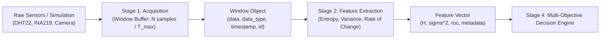

# Stage 1 & Stage 2 Documentation: Data Acquisition & Feature Extraction

**Project:** Predictive Multi-Objective Compression Selection  
**Pipeline Stages Covered:** 
- **Stage 1:** Data Acquisition & Windowing
- **Stage 2:** Feature Extraction (Shannon Entropy, Variance, Rate of Change)

---

## 1. Overview & Purpose

In IoT edge telemetry systems, continuous high-frequency sensor readings must be processed efficiently. Stages 1 and 2 form the input and analysis foundation of the entire pipeline:
1. **Stage 1 (Acquisition & Windowing):** Converts a continuous, heterogeneous sensor stream into discrete, uniform time/sample windows.
2. **Stage 2 (Feature Extraction):** Condenses each window into key statistical and information-theoretic indicators (Shannon Entropy, Variance, Rate of Change) required by the Stage 4 Decision Engine to select the optimal compression algorithm.



---

## 2. Mathematical Foundations & Algorithms

### Stage 1: Windowing Algorithm
Given a continuous stream of sensor readings, a window $W_k$ is accumulated according to:
- **Window Size ($N$):** Maximum number of samples per window (configured via `WINDOW_SIZE_N = 50`).
- **Timeout ($T_{max}$):** Maximum wait duration (seconds) before emitting a partial window if sensor transmission is slow.

$$\text{Window } W_k = \{ s_1, s_2, \dots, s_m \} \quad \text{where } m = \min(N, \text{samples within } T_{max})$$

### Stage 2: Feature Extraction

#### 1. Histogram Discretization & Shannon Entropy ($H$)
Discretizes numeric series into $B$ equal-width histogram bins over the observed dynamic range $[x_{min}, x_{max}]$:
- Probability of bin $i$:
  $$p_i = \frac{\text{count}(\text{bucket}_i)}{N}$$
- **Shannon Entropy ($H$):**
  $$H = -\sum_{i=1, p_i > 0}^B p_i \log_2(p_i)$$
- **Physical Interpretation:**
  - $H \approx 0.0$: Signal is constant or highly redundant $\implies$ Highly compressible via delta/dictionary algorithms.
  - $H \to \log_2(B)$ (e.g. $4.0$ for $16$ bins): High randomness / noise $\implies$ Harder to compress losslessly.

#### 2. Statistical Variance ($\sigma^2$)
Measures the dispersion / thermal fluctuation across the window:
$$\sigma^2 = \frac{1}{N} \sum_{t=1}^N (x_t - \bar{x})^2$$

#### 3. Rate of Change ($\text{RoC}$)
Measures the average step-to-step absolute transition magnitude:
$$\text{RoC} = \frac{1}{N-1} \sum_{t=2}^N |x_t - x_{t-1}|$$

---

## 3. Codebase Architecture

```
edge/
├── config.py                 # Hyperparameters (N=50, T_max=5.0s, weights)
├── stage1_acquisition.py     # Window class & AcquisitionStage engine
├── stage2_features.py        # FeatureExtractionStage (Entropy, Var, RoC)
└── sensors/
    ├── simulated_source.py   # Hybrid simulated generator & hardware coordinator
    ├── camera_reader.py      # CSI/USB camera reader (Picamera2 / OpenCV / CLI)
    ├── dht22_reader.py       # DHT22 GPIO sensor reader
    └── ina219_power.py       # INA219 I2C power sensor reader
tests/
├── test_stage1.py            # Unit tests for Stage 1 (partitioning, timeouts)
└── test_stage2.py            # Unit tests for Stage 2 (entropy bounds, variance)
```

---

## 4. Hardware vs. Simulation Modes

The pipeline contains an automatic **hybrid fallback architecture**:

| Mode | Configuration | Behavior |
|---|---|---|
| **Simulation Mode** (Default) | `USE_REAL_HARDWARE = False` in `simulated_source.py` | Generates realistic, fluctuating DHT22 temperature/humidity, INA219 power, and synthetic camera frames. Runs on any laptop or OS. |
| **Physical Hardware Mode** | `USE_REAL_HARDWARE = True` in `simulated_source.py` | Reads real physical sensors on Raspberry Pi. |
| **Hybrid Fallback Mode** | `USE_REAL_HARDWARE = True` (with partial hardware) | If a camera is connected but DHT22/INA219 are not, it **reads real camera frames while safely simulating missing sensors without crashing**. |

---

## 5. Execution & Testing Guide

### 1. Run Stage 1 Standalone
Acquires live or simulated windows and prints sample previews:
```bash
python -m edge.stage1_acquisition
```

### 2. Run Stage 2 Standalone
Tests feature extraction on synthetic constant, ramp, and noise windows:
```bash
python -m edge.stage2_features
```

### 3. Run Pipeline End-to-End One-Liner
Acquires a window and extracts features immediately:
```bash
python -c "from edge.stage1_acquisition import AcquisitionStage; from edge.stage2_features import FeatureExtractionStage; s1 = AcquisitionStage(window_size=10); s2 = FeatureExtractionStage(); win = s1.acquire_window(); feats = s2.extract_features(win); print('Acquired:', win); print('Features:', feats)"
```

### 4. Run Automated Unit Test Suite
Runs all 10 unit test cases validating mathematical bounds and partitioning:
```bash
python -m unittest tests/test_stage1.py tests/test_stage2.py
```

---

## 6. Sample Output

```json
{
  "window_id": 1,
  "timestamp": 1788107073.2044938,
  "data_type": "numeric",
  "sample_count": 5,
  "entropy": 2.3219,
  "variance": 0.0387,
  "rate_of_change": 0.27,
  "min_val": 23.71,
  "max_val": 24.23,
  "mean_val": 23.962
}
```
